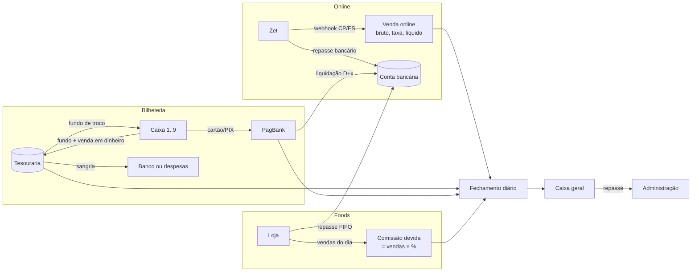
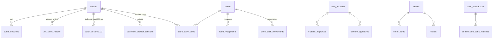

# Lógica de negócio a preservar

Tudo o que está aqui foi extraído do código e da documentação do `iluminadarua2025`. Onde o código e a documentação se contradizem, o ponto está marcado como **[DÚVIDA]** e repetido em `08-DUVIDAS.md`.

## 1. Glossário

| Termo | Significado no sistema |
|-------|------------------------|
| **Evento** | A temporada (ex.: "Rua Iluminada 2025"), com várias datas e sessões. |
| **Sessão / show time** | Data e horário de visitação vendável. |
| **Tipo de ingresso** | Inteira, Meia, Social/Gazeta, Cortesia. |
| **Zet / CompreNoZet** | Plataforma de venda online. Envia webhooks `CP` (compra paga) e `ES` (estorno). |
| **Bruto (`totalValue`)** | Valor pago pelo cliente na Zet = preço do ingresso + taxa Zet. |
| **Taxa (`totalTax`)** | Taxa de conveniência: **acréscimo de 10% sobre o preço**, paga pelo cliente e **retida pela Zet**. Não é receita nem despesa do evento. |
| **Líquido** | `bruto − taxa` = preço do ingresso: **a receita do evento** e o que a Zet repassa. |
| **Repasse online** | Transferência da Zet para a conta do evento (`online_transfers`: esperado × recebido). |
| **Bilheteria** | Venda física: dinheiro, cartão/PIX na maquininha PagBank e cartões físicos de ingresso por caixa. |
| **Bilheteria / caixa** | Um dos **9 caixas** físicos. Cada um abre o dia com um **fundo de troco** e o devolve no fechamento, junto com a venda do dia. |
| **Fundo de troco** | Dinheiro do evento entregue a cada caixa para começar o dia. Não é receita: sai da tesouraria e volta para ela no fechamento. |
| **Tesouraria / cofre** | Onde fica o dinheiro do evento entre o fechamento dos caixas e a sangria. |
| **Sangria** | Depois do fechamento, retirada do dinheiro da tesouraria para **depósito numa conta bancária** ou para **pagamento de despesas do evento**. |
| **Assinantes do fechamento** | As **duas pessoas designadas** para assinar o relatório de fechamento. São escolhidas durante o evento e podem ser trocadas a qualquer momento. |
| **Food / loja** | Operação de alimentação parceira. Informa vendas do dia; o evento tem direito a um **percentual de comissão** sobre elas. |
| **Repasse de food** | Pagamento da comissão pela loja ao evento, distribuído entre os dias pendentes em ordem FIFO. |
| **Sangria / despesa / ajuste** | Movimentos de caixa de uma loja (`store_cash_movements`). |
| **Fechamento diário** | Conferência do dia (online + bilheteria + comissões + troco + catraca), com assinatura e aprovação. |
| **Caixa geral** | Soma dos fechamentos diários menos os repasses já feitos à administração. |
| **Repasse à administração** | Transferência do saldo do evento para a administração, mantendo um caixa mínimo (padrão R$ 1.000). |
| **Catraca / RFID** | Controle de acesso. Serve para conferir ingressos vendidos × entradas. |

## 2. Fluxos financeiros

### 2.1 Venda online (Zet)
1. A Zet envia `action = CP` com `order.uuid`, `totalValue`, `totalTax`, `discount`, `paymentType`, `paymentSituation = PAGO`, `paymentConfirmeDate` e a lista `eventTicketCodes` (1 por ingresso, com `voucher` e `eventsValues.description` = tipo).
2. O sistema grava a venda **com os valores exatos recebidos**. Regra: **nunca recalcular a taxa**.
3. `paymentType = CORTESIA` indica ingresso cortesia (valor zero).
4. `action = ES` ou `paymentSituation ∈ {ESTORNADO, ESTORNO}` indica estorno do **pedido inteiro**: a venda vira ESTORNADO e os ingressos são cancelados.
5. Cada voucher vira um ingresso validável na catraca.
6. O repasse da Zet cai na conta bancária e é conciliado contra a soma dos líquidos do período (`online_transfers.expected_amount` × `received_amount`).

**Regra da taxa (confirmada):** a taxa é um **acréscimo de 10% sobre o preço do ingresso** (o líquido), cobrado do cliente e retido pela Zet.

| | Valor |
|---|---|
| Preço do ingresso (líquido, receita do evento) | R$ 30,00 |
| Taxa Zet (10% sobre o líquido) | R$ 3,00 |
| `totalValue` no payload (bruto, pago pelo cliente) | R$ 33,00 |

Consequências:
- A **receita do evento é o líquido**. A taxa é da Zet e não entra como receita nem como despesa do evento.
- Validação (sem reescrever nada): `taxa ≈ arredondar(líquido × 10%)`. Como a Zet pode arredondar por ingresso, aceita-se uma diferença de até 1 centavo por ingresso; acima disso, abre-se exceção para conferir com a Zet.
- Visto sobre o bruto, a taxa dá 9,09% (`3/33`). O documento `FINANCIAL-CALCULATIONS.md` calculava "10% do bruto" e por isso achava que a Zet cobrava a mais. **Essa regra estava errada**; a de `COMPRENOZET-TAX-CALCULATION.md` estava certa.

**Estorno online (confirmado):** o evento devolve **só o preço do ingresso**; a taxa da Zet não é estornada pelo evento.

**Desconto (confirmado):** só existe em **campanhas**. O desconto reduz o preço do ingresso, e portanto a receita do evento; a taxa é calculada sobre o valor já com desconto. O sistema guarda `discount` na venda para o relatório de campanhas. **Ainda a confirmar com a Zet** (técnico): se `totalValue` já vem com o desconto aplicado. O webhook antigo gravava `orders.total_amount = totalValue − discount` e `gross_amount = totalValue`, o que só estaria certo em um dos dois casos.

**Dia operacional do online (confirmado):** vai de 00:00 a 23:59:59 no horário de Brasília (`America/Sao_Paulo`), pela data de pagamento.

### 2.2 Bilheteria física (9 caixas)
1. **Abertura**: cada um dos 9 caixas recebe da tesouraria o seu **fundo de troco** (valor definido por caixa) e a **quantidade inicial de cartões de ingresso** (inteira, meia e social).
2. **Venda**: dinheiro, cartão ou PIX (maquininha PagBank). Produtos vendidos no caixa entram na bilheteria, mas não no ticket médio.
3. **Estorno na bilheteria**: sempre **total** (a venda inteira é devolvida ao cliente, pelo mesmo meio de pagamento).
4. **Fechamento do caixa**: informam-se os cartões restantes (vendidos = iniciais − restantes), o **dinheiro contado**, o total da maquininha e o total de PIX. O caixa **devolve o fundo de troco junto com a venda do dia**.
   - Dinheiro esperado = fundo de troco + vendas em dinheiro − estornos em dinheiro.
   - Diferença entre contado e esperado = quebra (falta) ou sobra, sempre registrada com justificativa.
5. **Dia operacional da bilheteria (confirmado)**: termina **quando o caixa é fechado** para aquele dia, e não à meia-noite. Uma venda às 00:20 num caixa ainda aberto pertence ao dia daquele caixa.
6. Cartão e PIX têm taxa PagBank por modalidade (`pagbank_fee_config`: PIX 0,40%, débito 1,28%, crédito 3,08%). Hoje o sistema **estima** a taxa por média ponderada (2,27%) ou por um padrão de 2,5%. No novo sistema, a taxa **real** tem que vir do CSV ou extrato do PagBank.

### 2.3 Foods (lojas parceiras)
1. A loja informa `total_sales` do dia. O sistema calcula `commission_amount = total_sales × commission_percentage`.
2. A comissão fica **pendente** até a loja fazer o repasse.
3. O repasse (`food_repayments`) é **distribuído FIFO** entre os dias pendentes selecionados (mais antigo primeiro). Cada dia fica `pending`, `partial` ou `paid`.
4. O repasse entra como **receita** no caixa do evento (`source = food_repayment`).
5. A loja tem movimentos próprios (sangria, despesa, ajustes) e fechamento próprio (`store_daily_closures`: vendas do dia e acumuladas, saídas, dinheiro esperado × declarado, diferença).
6. Os foods **não entram** no saldo financeiro da bilheteria nem no ticket médio. Aparecem só como informação no relatório.

**Confirmado:** a **loja paga a comissão ao evento**. O `FoodRepaymentService` está certo (repasse = receita do evento). O manual (passo 3.6), que fala em "pagar comissões de lojas" como despesa, está errado e deve ser corrigido no novo sistema: o passo passa a ser **"receber comissões das lojas"**.

### 2.4 Fechamento diário
1. **Importar**: repasses online recebidos na data e transações PagBank liquidadas na data.
2. **Caixas da bilheteria**: os 9 caixas fechados, cada um com o fundo de troco devolvido, dinheiro contado e diferença justificada.
3. **Movimentações manuais**: receitas e despesas com forma de pagamento.
4. **Catraca**: contagem inicial e final × ingressos vendidos (tolerância de 5 a 10; mais de 20 é alerta de fraude).
5. **Comissões**: marcar as comissões **recebidas das lojas** e ajustar o valor (desconto acordado).
6. **Revisão**: receitas − despesas = saldo; saldo físico deve ser igual ao saldo calculado.
7. **Assinaturas (confirmado)**: o relatório é assinado pelas **duas pessoas designadas** para o fechamento. A designação é feita durante o evento e pode ser trocada a qualquer momento; vale quem estiver designado **no momento da assinatura**. Sai um PDF com as duas assinaturas e QR de verificação.
8. **Sangria (confirmado)**: depois do fechamento, o dinheiro da tesouraria é retirado para **depósito em conta bancária** ou para **pagamento de despesas do evento** (com comprovante).
9. Depois de fechado, **não pode ser editado**; só um admin reabre. Essa regra está no manual, mas **não é garantida pelo banco** no sistema antigo.

**Fórmulas atuais** (`src/services/closureCalculationService.ts`):
- Dinheiro final = entradas − troco utilizado.
- Cartão líquido = bruto − taxa.
- Saldo financeiro = dinheiro + cartão líquido + online (**sem foods**).
- Total de vendas (relatório) = dinheiro + cartão líquido + produtos + online + foods.
- Ticket médio = (dinheiro + cartão + online) / total de ingressos (**sem foods e sem produtos**).
- Divergência vendidos × validados: alerta acima de 5%, crítico acima de 10%.

### 2.5 Caixa geral e repasse à administração
- Receita total = Σ fechamentos. Saldo = receita − despesa. Saldo acumulado = saldo − Σ repasses à administração.
- Sugestão de repasse = saldo acumulado − caixa mínimo (R$ 1.000).

## 3. Regras que DEVEM ser mantidas

| # | Regra |
|---|-------|
| R1 | Valores de venda online são os **exatos recebidos da Zet**. A taxa nunca é recalculada. A **receita do evento é o líquido** (`totalValue − totalTax`); a taxa é da Zet. |
| R2 | Idempotência por `order.uuid`: um pedido corresponde a uma venda. |
| R3 | Estorno online: o evento devolve **só o preço do ingresso** (o líquido); a taxa da Zet não é estornada. Estorno na bilheteria: sempre **total**. |
| R4 | Cortesia = venda com valor zero, contada como ingresso e fora da receita. |
| R5 | Comissão de food = `vendas × %` da loja, **arredondada a centavos uma única vez** (hoje isso é inconsistente). |
| R6 | A **loja paga a comissão ao evento**. O repasse de food é distribuído **FIFO** entre os dias pendentes. |
| R7 | Foods ficam fora do saldo da bilheteria e do ticket médio. |
| R8 | Produtos ficam dentro da bilheteria e fora do ticket médio. |
| R9 | Fechamento diário exige conferência física e a assinatura das **duas pessoas designadas** no momento da assinatura (designação alterável a qualquer momento). |
| R10 | Fechamento aprovado é imutável; só um admin reabre, com motivo registrado. |
| R11 | Repasse à administração preserva um caixa mínimo configurável. |
| R12 | Dia operacional: **online** = 00:00–23:59:59 em America/Sao_Paulo; **bilheteria** = até o fechamento do caixa daquele dia. |
| R14 | Cada um dos 9 caixas abre com um **fundo de troco** e o devolve no fechamento junto com a venda. O fundo não é receita. |
| R15 | Após o fechamento, a **sangria** leva o dinheiro para conta bancária ou para pagamento de despesas do evento, sempre com registro. |
| R16 | Descontos só existem em **campanhas** e reduzem a receita do ingresso. |
| R13 | Divergência de catraca: alerta acima de 5%, crítico acima de 10%; mais de 20 entradas de diferença é suspeita de fraude. |

## 4. Modelo de dados atual (resumo)

Tabelas legadas que coexistem com dados sobrepostos: `orders`, `online_sales`, `online_sales_transactions` (DEPRECATED), `transacoes` (DEPRECATED), `imported_sales`, `zet_sales_master`, `daily_closures` e `daily_closures_v2`. **Existem pelo menos 5 representações da mesma venda online.**
