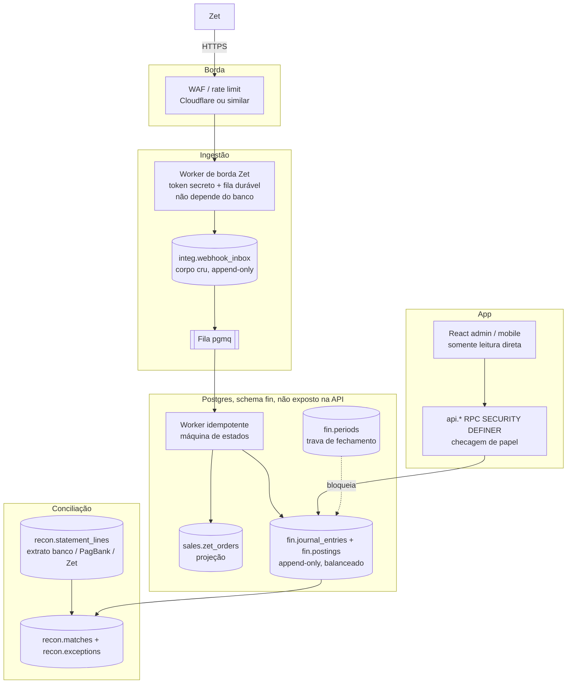

# Arquitetura-alvo

As referências de mercado usadas aqui são os padrões publicados de livro-razão da Stripe ("Ledger"), da Modern Treasury ("How to build a ledger"), do TigerBeetle (contas, transferências e invariantes no banco) e do Square (Books); os padrões *Transactional Inbox/Outbox*; o OWASP API Security Top 10 (2023); e a contabilidade de partidas dobradas.

## 1. Visão geral



**Stack recomendada:** manter **Postgres via Supabase**, que você já domina e que resolve bem autenticação e hospedagem, mas mudar **como** ele é usado:

| Hoje | Alvo |
|------|------|
| O navegador escreve direto nas tabelas via PostgREST | O navegador **só lê** (views). As escritas passam por RPC `api.*` com checagem de papel |
| 111 edge functions com `service_role` | Poucas funções: webhook, worker, importadores de extrato. Todas com autenticação |
| Regra financeira em TS no front | Regra financeira em **SQL (plpgsql) no schema `fin`**, com testes |
| `NUMERIC`, float e JSON | `BIGINT` em centavos |
| Backups caseiros | Plano **Pro com PITR** + `pg_dump` diário para um bucket externo com *object lock* |
| Filas inexistentes | **Supabase Queues (pgmq)** + `pg_cron` para os workers |

## 2. Dinheiro

### 2.1 Regras
1. Todo valor é **`BIGINT` em centavos** no banco e **`bigint`** (ou inteiro seguro) no TypeScript. Nenhuma coluna monetária é `NUMERIC` sem escala, `REAL` ou JSON.
2. Percentuais em **pontos-base inteiros** (15% = `1500`; 3,08% = `308`).
3. **Um único arredondamento**, meio-para-cima (*half-up*), aplicado **uma vez** no ponto em que o valor nasce (ex.: comissão do dia). Nunca arredondar parcelas intermediárias.
4. Rateios usam o **método do maior resto**, então a soma das partes é **sempre** igual ao total.
5. Na entrada (JSON da Zet, CSV do banco), converter para centavos **rejeitando** valores com mais de 2 casas.
6. Reais aparecem **só na exibição** (`Intl.NumberFormat('pt-BR', {style:'currency', currency:'BRL'})`).

### 2.2 Módulo `money.ts` (único no projeto, com testes de propriedade)

```ts
export type Cents = bigint;

/** Converte número vindo de JSON (ex.: 11.2) para centavos; rejeita > 2 casas. */
export function toCentsStrict(v: number): Cents {
  if (!Number.isFinite(v)) throw new Error(`valor inválido: ${v}`);
  const scaled = v * 100;
  const rounded = Math.round(scaled);
  if (Math.abs(scaled - rounded) > 1e-6) throw new Error(`mais de 2 casas decimais: ${v}`);
  if (!Number.isSafeInteger(rounded)) throw new Error(`fora do intervalo: ${v}`);
  return BigInt(rounded);
}

/** "1.234,56" | "1234.56" | "-10,00" -> centavos. */
export function parseBRL(s: string): Cents {
  const t = s.trim().replace(/\s|R\$/g, '');
  const m = /^(-)?(\d{1,3}(?:\.\d{3})*|\d+)(?:[,.](\d{1,2}))?$/.exec(t);
  if (!m) throw new Error(`formato inválido: ${s}`);
  const int = m[2].replace(/\./g, '');
  const frac = (m[3] ?? '').padEnd(2, '0');
  const c = BigInt(int) * 100n + BigInt(frac);
  return m[1] ? -c : c;
}

/** valor × taxa (pontos-base), arredondado half-up. Ex.: 123456n × 1500 -> 18518n (R$ 185,18). */
export function applyRate(amount: Cents, bps: bigint): Cents {
  if (amount < 0n || bps < 0n) throw new Error('applyRate espera valores não negativos');
  return (amount * bps + 5_000n) / 10_000n;
}

/** Rateio pelo maior resto: soma(resultado) === total, sempre. */
export function allocate(total: Cents, weights: bigint[]): Cents[] {
  if (total < 0n) throw new Error('total negativo');
  const sum = weights.reduce((a, b) => a + b, 0n);
  if (sum <= 0n || weights.some((w) => w < 0n)) throw new Error('pesos inválidos');
  const parts = weights.map((w) => (total * w) / sum);
  let left = total - parts.reduce((a, b) => a + b, 0n);
  const order = weights
    .map((w, i) => ({ i, r: (total * w) % sum }))
    .sort((a, b) => (b.r > a.r ? 1 : b.r < a.r ? -1 : a.i - b.i));
  for (let k = 0; left > 0n; k++, left--) parts[order[k].i] += 1n;
  return parts;
}

export const formatBRL = (c: Cents) =>
  new Intl.NumberFormat('pt-BR', { style: 'currency', currency: 'BRL' }).format(Number(c) / 100);
```

Casos que viram teste:
- `applyRate(123456n, 1500n) === 18518n` (hoje o sistema grava `185.184`).
- `applyRate(1005n, 1000n) === 101n` (hoje `roundCurrency(1.005) = 1.00`).
- `allocate(3000n, [2000n, 1000n])` dá `[2000n, 1000n]` (pedido inteira + meia; hoje o sistema grava 15 + 15).
- `allocate(1000n, [1n, 1n, 1n])` dá `[334n, 333n, 333n]`.
- Propriedade (fast-check): para quaisquer `total ≥ 0` e pesos válidos, `sum(allocate(total, w)) === total` e cada parte difere da parte ideal em menos de 1 centavo.

No SQL, a mesma regra: `(amount_cents * bps + 5000) / 10000` em `bigint`.

## 3. Livro-razão de partidas dobradas

### 3.1 Conceitos
- **Conta**: onde o saldo mora (Caixa físico, Banco X, A receber Zet, A receber loja Y, Receita ingressos online...).
- **Lançamento** (*journal entry*): um fato econômico (ex.: "venda Zet pedido abc"), com **2 ou mais partidas**.
- **Partida** (*posting*): débito ou crédito de um valor positivo numa conta.
- **Invariante**: em todo lançamento, `Σ débitos = Σ créditos`. Garantida **pelo banco**, não pela aplicação.
- **Imutável**: nada é alterado ou apagado. Um erro é corrigido com um **lançamento de estorno** (espelho) mais um novo lançamento correto.
- **Idempotência**: cada lançamento tem uma `idempotency_key` única (ex.: `zet:CP:<order_uuid>`). Reprocessar não duplica.

### 3.2 Plano de contas por evento (sugestão, a validar com o contador)

| Código | Conta | Tipo | Natureza |
|--------|-------|------|----------|
| 1.1.00 | Tesouraria / cofre do evento | Ativo | D |
| 1.1.01 a 1.1.09 | Caixa bilheteria 1 a 9 | Ativo | D |
| 1.1.10+ | Banco – uma conta por conta bancária cadastrada (criadas e desativadas durante o evento) | Ativo | D |
| 1.2.01 | A receber – Zet | Ativo | D |
| 1.2.02 | A receber – PagBank (cartão/PIX) | Ativo | D |
| 1.2.10+ | A receber – comissão loja *N* (o saldo é a falta de repasse da loja) | Ativo | D |
| 2.1.01 | Crédito de loja (repasse a maior) | Passivo | C |
| 3.1.01 | Repasses à administração | Patrimônio | D |
| 4.1.01 | Receita ingressos online (líquido = preço do ingresso) | Receita | C |
| 4.1.02 | Receita ingressos bilheteria | Receita | C |
| 4.1.03 | Receita produtos bilheteria | Receita | C |
| 4.2.01 | Receita comissão foods | Receita | C |
| 4.9.01 | Estornos de ingressos online | Redutora de receita | D |
| 4.9.02 | Estornos da bilheteria | Redutora de receita | D |
| 4.9.03 | Contestações online (chargeback / PIX MED), pelo extrato da Zet | Redutora de receita | D |
| 4.1.04 | Receita de ingressos vendidos na máquina da Zet (líquida) | Receita | C |
| 5.1.03 | Taxa de saque Zet | Despesa | D |
| 5.1.02 | Taxa PagBank (MDR) | Despesa | D |
| 5.2.01 | Quebra de caixa | Despesa | D |
| 5.2.02 | Baixa de comissão não recebida (só admin, com motivo) | Despesa | D |
| 5.9.xx | Despesas operacionais | Despesa | D |

### 3.3 Lançamentos-padrão

| Fato | Débito | Crédito |
|------|--------|---------|
| Venda Zet (CP): ingresso 30,00, taxa 3,00, cliente paga 33,00 | A receber Zet 30,00 | Receita online 30,00 |
| Estorno Zet (ES) do mesmo pedido | Estornos online 30,00 | A receber Zet 30,00 |
| Repasse Zet cai no banco (98.000,00) | Banco 98.000,00 | A receber Zet 98.000,00 |
| Início do dia: retirada do banco para os fundos de troco | Tesouraria | Banco |
| Abertura do caixa 3 com fundo de troco de 200,00 | Caixa bilheteria 3 200,00 | Tesouraria 200,00 |
| Venda bilheteria em dinheiro | Caixa bilheteria N | Receita bilheteria |
| Estorno na bilheteria (sempre total), em dinheiro | Estornos da bilheteria | Caixa bilheteria N |
| Sangria parcial durante o dia (registrada na hora) | Tesouraria | Caixa bilheteria N |
| Estorno na bilheteria, em cartão/PIX | Estornos da bilheteria | A receber PagBank |
| Venda bilheteria em cartão, bruto 100,00, MDR real 3,08 | A receber PagBank 96,92 · Taxa PagBank 3,08 | Receita bilheteria 100,00 |
| Liquidação PagBank | Banco | A receber PagBank |
| Fechamento do caixa 3: devolve fundo + venda em dinheiro (contado) | Tesouraria (contado) | Caixa bilheteria 3 (contado) |
| Quebra de caixa (contado < esperado) | Quebra de caixa | Caixa bilheteria N |
| Sobra de caixa | Caixa bilheteria N | Receita/Outras (ou passivo a apurar) |
| Sangria para depósito bancário (venda + fundos de troco) | Banco (conta escolhida) | Tesouraria |
| Transferência entre contas bancárias | Banco destino | Banco origem |
| Sangria para pagar despesa do evento (com comprovante) | Despesa correspondente (5.9.xx) | Tesouraria |
| Comissão loja do dia (vendas 1.234,56 × 15%) | A receber loja N 185,18 | Receita comissão foods 185,18 |
| Repasse da loja do dia, valor cheio (FIFO) | Banco / Tesouraria | A receber loja N (excedente em Crédito de loja) |
| Loja deve 500,00 e paga 450,00 | Banco / Tesouraria 450,00 | A receber loja N 450,00 *(os 50,00 continuam no saldo da loja = falta de repasse, com alerta)* |
| Baixa de falta de repasse (só admin, com motivo) | Baixa de comissão não recebida | A receber loja N |
| Repasse à administração | Repasses à administração | Banco |

A **taxa da Zet não entra no livro-razão**: é um acréscimo pago pelo cliente e retido pela própria Zet, então nunca passa pelo caixa do evento. Bruto e taxa ficam registrados na venda (`sales.zet_orders`) para conferência. No estorno, o evento devolve só o preço do ingresso (R$ 30,00); a taxa continua sendo assunto entre cliente e Zet e nunca afeta o saldo do evento.

A pergunta "**quanto a Zet ainda me deve?**" passa a ser o **saldo da conta 1.2.01**. "Quanto a loja N deve?" é o saldo da 1.2.1N. "Quanto deveria haver no caixa 3?" é o saldo da 1.1.03 (fundo de troco + vendas em dinheiro − estornos). Depois do fechamento, o saldo do caixa volta a zero e o dinheiro aparece na Tesouraria até a sangria. **A conciliação vira comparar saldo de conta com extrato.**

### 3.4 DDL

```sql
create schema if not exists fin;
create schema if not exists sales;
create schema if not exists integ;
create schema if not exists recon;
create schema if not exists audit;

-- ---------- Plano de contas ----------
create table fin.accounts (
  id            bigserial primary key,
  event_id      uuid not null references public.events(id) on delete restrict,
  code          text not null,
  name          text not null,
  type          text not null check (type in ('asset','liability','equity','revenue','expense')),
  normal_side   char(1) not null check (normal_side in ('D','C')),
  counterparty  text,                         -- 'zet' | 'pagbank' | 'store:<uuid>' | 'cashier:<n>'
  archived_at   timestamptz,
  unique (event_id, code)
);

-- ---------- Períodos (dia operacional, America/Sao_Paulo) ----------
create table fin.periods (
  event_id        uuid not null references public.events(id) on delete restrict,
  business_date   date not null,
  status          text not null default 'open' check (status in ('open','closing','closed')),
  closed_at       timestamptz,
  closed_by       uuid references auth.users(id),
  approved_by     uuid references auth.users(id),
  snapshot_sha256 bytea,                      -- hash dos lançamentos do dia no fechamento
  primary key (event_id, business_date)
);

create table fin.period_reopenings (
  id            bigserial primary key,
  event_id      uuid not null,
  business_date date not null,
  reopened_at   timestamptz not null default now(),
  reopened_by   uuid not null references auth.users(id),
  reason        text not null check (length(reason) >= 10),
  foreign key (event_id, business_date) references fin.periods(event_id, business_date)
);

-- ---------- Lançamentos ----------
create table fin.journal_entries (
  id                uuid primary key default gen_random_uuid(),
  event_id          uuid not null references public.events(id) on delete restrict,
  business_date     date not null,
  occurred_at       timestamptz not null,
  recorded_at       timestamptz not null default now(),
  kind              text not null,            -- zet_sale | zet_refund | pos_cash | pos_card | food_commission | food_repayment | cash_shortage | reversal | adjustment | admin_transfer ...
  description       text not null,
  idempotency_key   text not null unique,
  source_type       text,                     -- zet_order | cashier_session | store_daily_sale | statement_line ...
  source_id         text,
  reverses_entry_id uuid references fin.journal_entries(id),
  created_by        uuid references auth.users(id),
  metadata          jsonb not null default '{}'
);
create unique index journal_entries_one_reversal
  on fin.journal_entries(reverses_entry_id) where reverses_entry_id is not null;
create index on fin.journal_entries(event_id, business_date);
create index on fin.journal_entries(source_type, source_id);

create table fin.postings (
  id            bigserial primary key,
  entry_id      uuid not null references fin.journal_entries(id) on delete restrict,
  account_id    bigint not null references fin.accounts(id) on delete restrict,
  side          char(1) not null check (side in ('D','C')),
  amount_cents  bigint not null check (amount_cents > 0),
  currency      char(3) not null default 'BRL' check (currency = 'BRL')
);
create index on fin.postings(account_id);
create index on fin.postings(entry_id);

-- ---------- Invariante: lançamento balanceado (checado no COMMIT) ----------
create or replace function fin.assert_entry_balanced(p_entry uuid) returns void
language plpgsql as $$
declare d bigint; c bigint; n int;
begin
  select coalesce(sum(amount_cents) filter (where side = 'D'), 0),
         coalesce(sum(amount_cents) filter (where side = 'C'), 0),
         count(*)
    into d, c, n
    from fin.postings where entry_id = p_entry;
  if n < 2 or d <> c then
    raise exception 'Lançamento % desbalanceado: D=% C=% partidas=%', p_entry, d, c, n;
  end if;
end $$;

create or replace function fin.trg_posting_balanced() returns trigger
language plpgsql as $$
begin
  perform fin.assert_entry_balanced(new.entry_id);
  return null;
end $$;

create or replace function fin.trg_entry_has_postings() returns trigger
language plpgsql as $$
begin
  perform fin.assert_entry_balanced(new.id);
  return null;
end $$;

create constraint trigger postings_balanced
  after insert on fin.postings deferrable initially deferred
  for each row execute function fin.trg_posting_balanced();
create constraint trigger entries_have_postings
  after insert on fin.journal_entries deferrable initially deferred
  for each row execute function fin.trg_entry_has_postings();

-- ---------- Imutabilidade ----------
create or replace function fin.forbid_mutation() returns trigger
language plpgsql as $$
begin
  raise exception '% é append-only: corrija com lançamento de estorno', tg_table_name;
end $$;

create trigger je_no_update before update or delete on fin.journal_entries
  for each row execute function fin.forbid_mutation();
create trigger je_no_truncate before truncate on fin.journal_entries
  for each statement execute function fin.forbid_mutation();
create trigger p_no_update before update or delete on fin.postings
  for each row execute function fin.forbid_mutation();
create trigger p_no_truncate before truncate on fin.postings
  for each statement execute function fin.forbid_mutation();

-- ---------- Trava de período ----------
create or replace function fin.trg_period_open() returns trigger
language plpgsql as $$
begin
  if exists (select 1 from fin.periods p
              where p.event_id = new.event_id
                and p.business_date = new.business_date
                and p.status = 'closed') then
    raise exception 'Dia % está fechado. Lance o ajuste em um dia aberto referenciando o original.',
      new.business_date;
  end if;
  return new;
end $$;
create trigger je_period_open before insert on fin.journal_entries
  for each row execute function fin.trg_period_open();

-- ---------- Saldos (derivados, nunca digitados) ----------
create view fin.v_account_balances as
select a.event_id, a.id as account_id, a.code, a.name, a.type,
       coalesce(sum(case when p.side = a.normal_side then p.amount_cents else -p.amount_cents end), 0) as balance_cents
  from fin.accounts a
  left join fin.postings p on p.account_id = a.id
 group by a.id;

create view fin.v_daily_account_movements as
select e.event_id, e.business_date, p.account_id,
       sum(p.amount_cents) filter (where p.side = 'D') as debit_cents,
       sum(p.amount_cents) filter (where p.side = 'C') as credit_cents
  from fin.journal_entries e
  join fin.postings p on p.entry_id = e.id
 group by 1, 2, 3;

-- ---------- Única porta de escrita ----------
-- p_lines: [{"account_code":"1.2.01","side":"D","amount_cents":10000}, ...]
create or replace function fin.post_entry(
  p_event uuid, p_business_date date, p_occurred_at timestamptz,
  p_kind text, p_description text, p_idempotency_key text,
  p_source_type text, p_source_id text, p_lines jsonb,
  p_reverses uuid default null, p_metadata jsonb default '{}'
) returns uuid
language plpgsql security definer set search_path = fin, public as $$
declare v_id uuid; l jsonb;
begin
  insert into fin.journal_entries(event_id, business_date, occurred_at, kind, description,
                                  idempotency_key, source_type, source_id, reverses_entry_id,
                                  created_by, metadata)
  values (p_event, p_business_date, p_occurred_at, p_kind, p_description,
          p_idempotency_key, p_source_type, p_source_id, p_reverses, auth.uid(), p_metadata)
  on conflict (idempotency_key) do nothing
  returning id into v_id;

  if v_id is null then  -- já lançado: idempotente
    select id into v_id from fin.journal_entries where idempotency_key = p_idempotency_key;
    return v_id;
  end if;

  for l in select * from jsonb_array_elements(p_lines) loop
    insert into fin.postings(entry_id, account_id, side, amount_cents)
    select v_id, a.id, l->>'side', (l->>'amount_cents')::bigint
      from fin.accounts a
     where a.event_id = p_event and a.code = l->>'account_code' and a.archived_at is null;
    if not found then
      raise exception 'Conta % inexistente no evento %', l->>'account_code', p_event;
    end if;
  end loop;
  return v_id;
end $$;

-- Estorno: espelho exato do original
create or replace function fin.reverse_entry(p_entry uuid, p_business_date date, p_reason text)
returns uuid language plpgsql security definer set search_path = fin, public as $$
declare o fin.journal_entries; v_lines jsonb;
begin
  select * into o from fin.journal_entries where id = p_entry;
  if o.id is null then raise exception 'Lançamento % não existe', p_entry; end if;
  select jsonb_agg(jsonb_build_object(
           'account_code', a.code,
           'side', case p.side when 'D' then 'C' else 'D' end,
           'amount_cents', p.amount_cents))
    into v_lines
    from fin.postings p join fin.accounts a on a.id = p.account_id
   where p.entry_id = p_entry;
  return fin.post_entry(o.event_id, p_business_date, now(), 'reversal',
                        'Estorno: ' || p_reason, 'reversal:' || p_entry,
                        'journal_entry', p_entry::text, v_lines, p_entry,
                        jsonb_build_object('reason', p_reason));
end $$;

-- ---------- Permissões: ninguém altera ou apaga ----------
revoke all on all tables in schema fin from public, anon, authenticated;
revoke update, delete, truncate on fin.journal_entries, fin.postings from service_role;
grant usage on schema fin to authenticated;
grant select on fin.v_account_balances, fin.v_daily_account_movements to authenticated; -- + RLS por evento/papel
-- Escrita só via funções api.* (security definer) que checam papel antes de chamar fin.post_entry.
-- NÃO expor o schema fin no PostgREST (Settings > API > Exposed schemas: apenas "api").
```

### 3.5 Auditoria genérica (para cadastros e projeções)

```sql
create table audit.log (
  id          bigserial primary key,
  at          timestamptz not null default now(),
  actor       uuid default auth.uid(),
  table_name  text not null,
  op          text not null,
  row_pk      text,
  old_row     jsonb,
  new_row     jsonb
);
create or replace function audit.trg() returns trigger language plpgsql security definer as $$
begin
  insert into audit.log(table_name, op, row_pk, old_row, new_row)
  values (tg_table_schema || '.' || tg_table_name, tg_op,
          coalesce(to_jsonb(new)->>'id', to_jsonb(old)->>'id'),
          case when tg_op in ('UPDATE','DELETE') then to_jsonb(old) end,
          case when tg_op in ('INSERT','UPDATE') then to_jsonb(new) end);
  return coalesce(new, old);
end $$;
revoke update, delete, truncate on audit.log from public, anon, authenticated, service_role;
-- aplicar: create trigger audit after insert or update or delete on <tabela> for each row execute function audit.trg();
```

## 4. Fechamento diário no novo modelo

1. Durante o dia, cada fato gera lançamentos (webhook Zet, abertura de caixa com fundo de troco, vendas, estornos, vendas da loja).
2. **Dia operacional**: cada lançamento carrega o seu `business_date`. No online ele vem da data de pagamento em America/Sao_Paulo (virada à meia-noite). Na bilheteria ele vem da **sessão do caixa**: tudo o que é vendido enquanto o caixa está aberto pertence ao dia daquele caixa, mesmo depois da meia-noite.
3. **Fechamento de cada caixa**: o sistema calcula o esperado (saldo da conta do caixa = fundo + dinheiro − estornos), o operador declara o contado e o caixa devolve tudo à Tesouraria. **Diferença ≠ 0 vira lançamento** (quebra ou sobra), com justificativa obrigatória. Nada de `Math.max(0, …)`.
4. **Fechamento do dia**: só com os 9 caixas fechados. O sistema gera o resumo e o hash do conteúdo (`fin.day_snapshot`).
5. **Assinaturas**: as **duas pessoas designadas** assinam o mesmo hash. A designação é uma tabela com vigência (`valid_from`, `valid_to`), trocável a qualquer momento; o banco só aceita assinatura de quem está designado **naquele instante**. Se algum lançamento entrar depois de uma assinatura, o hash muda e a assinatura deixa de valer (é preciso assinar de novo).
6. `fin.close_period` exige **2 assinantes distintos sobre o mesmo hash** e então trava o dia (`status = 'closed'`). O PDF e o QR guardam o hash, e a verificação recalcula e compara.
7. **Sangria**: depois do fechamento, lançamento de Tesouraria → Banco (depósito) ou Tesouraria → Despesa (pagamento com comprovante), num dia aberto. Como **nada fica de um dia para o outro**, a Tesouraria tem de terminar zerada: se sobrar saldo, o sistema alerta antes da abertura do dia seguinte.
8. Ajuste depois do fechamento é **lançamento em dia aberto** com `metadata.adjusts_business_date`. Reabrir exige admin e motivo (`fin.period_reopenings`).
9. O **rascunho** do wizard fica em outra tabela (`closure_drafts`) e **nunca** escreve na tabela de períodos.

```sql
-- quem pode assinar o fechamento, com vigência (trocável a qualquer momento)
create table fin.closure_signer_designations (
  id            bigserial primary key,
  event_id      uuid not null references public.events(id) on delete restrict,
  user_id       uuid not null references auth.users(id),
  valid_from    timestamptz not null default now(),
  valid_to      timestamptz,
  designated_by uuid references auth.users(id),
  check (valid_to is null or valid_to > valid_from)
);

create table fin.period_signatures (
  event_id        uuid not null,
  business_date   date not null,
  signer_id       uuid not null references auth.users(id),
  signed_at       timestamptz not null default now(),
  snapshot_sha256 bytea not null,
  primary key (event_id, business_date, signer_id, snapshot_sha256),
  foreign key (event_id, business_date) references fin.periods(event_id, business_date)
);

-- hash do conteúdo financeiro do dia
create or replace function fin.day_snapshot(p_event uuid, p_date date) returns bytea
language sql stable as $$
  select sha256(convert_to(coalesce(string_agg(
           e.id::text || ':' || p.account_id || ':' || p.side || ':' || p.amount_cents,
           '|' order by e.id, p.id), ''), 'UTF8'))
    from fin.journal_entries e join fin.postings p on p.entry_id = e.id
   where e.event_id = p_event and e.business_date = p_date
$$;

-- só assina quem está designado no instante da assinatura
create or replace function fin.trg_signer_designated() returns trigger
language plpgsql as $$
begin
  if not exists (select 1 from fin.closure_signer_designations d
                  where d.event_id = new.event_id and d.user_id = new.signer_id
                    and d.valid_from <= new.signed_at
                    and (d.valid_to is null or d.valid_to > new.signed_at)) then
    raise exception 'Usuário % não está designado para assinar o fechamento em %', new.signer_id, new.signed_at;
  end if;
  return new;
end $$;
create trigger period_signatures_designated before insert on fin.period_signatures
  for each row execute function fin.trg_signer_designated();
create trigger period_signatures_no_update before update or delete on fin.period_signatures
  for each row execute function fin.forbid_mutation();

-- fecha o dia: 2 assinantes distintos sobre o conteúdo atual
create or replace function fin.close_period(p_event uuid, p_date date) returns bytea
language plpgsql security definer set search_path = fin, public as $$
declare v_hash bytea := fin.day_snapshot(p_event, p_date); n int;
begin
  select count(distinct signer_id) into n
    from fin.period_signatures
   where event_id = p_event and business_date = p_date and snapshot_sha256 = v_hash;
  if n < 2 then
    raise exception 'Fechamento de % exige 2 assinaturas distintas sobre o conteúdo atual (tem %)', p_date, n;
  end if;
  update fin.periods set status = 'closed', closed_at = now(), closed_by = auth.uid(), snapshot_sha256 = v_hash
   where event_id = p_event and business_date = p_date and status <> 'closed';
  if not found then raise exception 'Dia % inexistente ou já fechado', p_date; end if;
  return v_hash;
end $$;
```

### 4.1 Cadastros com vigência (caixas, lojas, contas)

```sql
-- sessão de caixa: operador e fundo de troco (o valor pode variar por operador)
create table fin.cashier_sessions (
  id              uuid primary key default gen_random_uuid(),
  event_id        uuid not null references public.events(id) on delete restrict,
  business_date   date not null,                 -- dia operacional do caixa
  cashier_number  int  not null check (cashier_number >= 1),
  operator_id     uuid not null references auth.users(id),
  float_cents     bigint not null check (float_cents >= 0),
  opened_at       timestamptz not null default now(),
  closed_at       timestamptz,
  counted_cash_cents bigint check (counted_cash_cents >= 0)
);
-- um caixa só pode ter uma sessão aberta por vez
create unique index cashier_one_open on fin.cashier_sessions(event_id, cashier_number) where closed_at is null;

-- percentual de comissão por loja, com vigência (mudança não altera dias passados)
create extension if not exists btree_gist;
create table fin.store_commission_rates (
  id          bigserial primary key,
  event_id    uuid not null references public.events(id) on delete restrict,
  store_id    uuid not null,                    -- references public.stores(id)
  rate_bps    int  not null check (rate_bps between 0 and 10000),  -- 15% = 1500
  valid_from  date not null,
  valid_to    date,
  created_by  uuid references auth.users(id),
  created_at  timestamptz not null default now(),
  check (valid_to is null or valid_to > valid_from),
  exclude using gist (store_id with =, daterange(valid_from, valid_to) with &&)
);
create or replace function fin.store_rate_bps(p_store uuid, p_date date) returns int
language sql stable as $$
  select rate_bps from fin.store_commission_rates
   where store_id = p_store and valid_from <= p_date and (valid_to is null or valid_to > p_date)
$$;

-- contas bancárias: cadastradas/alteradas durante o evento; nunca apagadas
create table fin.bank_accounts (
  id              bigserial primary key,
  event_id        uuid not null references public.events(id) on delete restrict,
  account_id      bigint not null unique references fin.accounts(id) on delete restrict,
  bank_name       text not null,
  branch          text,
  number          text not null,
  holder_name     text not null,
  holder_document text not null,
  archived_at     timestamptz,
  created_by      uuid references auth.users(id),
  created_at      timestamptz not null default now()
);
create trigger bank_accounts_no_delete before delete on fin.bank_accounts
  for each row execute function fin.forbid_mutation();
-- alterações ficam no audit.log (trigger audit.trg da seção 3.5)

-- configuração do evento: caixa mínimo
create table fin.event_settings (
  event_id              uuid primary key references public.events(id) on delete restrict,
  min_cash_cents        bigint not null default 100000 check (min_cash_cents >= 0),
  updated_by            uuid references auth.users(id),
  updated_at            timestamptz not null default now()
);

-- falta de repasse por loja = saldo em aberto da conta "A receber loja"
create view fin.v_store_pending as
select a.event_id, a.counterparty as store, a.code, a.name, b.balance_cents as pending_cents
  from fin.accounts a
  join fin.v_account_balances b on b.account_id = a.id
 where a.counterparty like 'store:%' and b.balance_cents > 0;
```

**Alerta de falta de repasse**: no fechamento de cada dia, toda loja com `pending_cents > 0` referente a dias anteriores gera alerta (valor e dias em aberto, pela ordem FIFO) e aparece no wizard do próximo caixa para cobrança.

## 5. Conciliação em três pontas

```sql
create table recon.statement_imports (
  id          bigserial primary key,
  source      text not null check (source in ('bank','pagbank','zet_report','zet_panel','zet_bordero')),
  file_name   text not null,
  file_sha256 bytea not null unique,           -- mesmo arquivo não entra duas vezes
  imported_at timestamptz not null default now(),
  imported_by uuid references auth.users(id)
);
create table recon.statement_lines (
  id            bigserial primary key,
  import_id     bigint not null references recon.statement_imports(id),
  source        text not null,
  external_id   text,                           -- id da transação no banco / PagBank / order uuid Zet
  value_date    date not null,
  amount_cents  bigint not null,               -- sinal: + entrada, - saída
  description   text,
  raw           jsonb not null,
  unique (source, external_id)
);
create table recon.matches (
  id                bigserial primary key,
  statement_line_id bigint not null references recon.statement_lines(id),
  entry_id          uuid not null references fin.journal_entries(id),
  matched_by        text not null check (matched_by in ('auto_exact','auto_rule','manual')),
  matched_at        timestamptz not null default now(),
  unique (statement_line_id, entry_id)
);
create table recon.exceptions (
  id            bigserial primary key,
  kind          text not null,   -- missing_in_system | missing_in_statement | amount_mismatch | duplicate
  ref           text not null,
  expected_cents bigint, actual_cents bigint,
  status        text not null default 'open' check (status in ('open','resolved','written_off')),
  resolution    text, resolved_by uuid, resolved_at timestamptz,
  created_at    timestamptz not null default now()
);
```

- **Zet × sistema**: relatório de vendas da Zet (planilha ou API) comparado com `sales.zet_orders` por `order_uuid`. Resultado: faltando no sistema, faltando na Zet ou valor diferente.
- **Zet × banco**: repasse bancário comparado com o saldo de "A receber Zet" que ele liquida.
- **PagBank × banco × sistema**: CSV de transações (bruto, MDR, líquido, data de liquidação) contra os lançamentos de bilheteria e o crédito no banco.
- **Critério de dia fechado**: toda linha do extrato daquele dia tem *match* ou exceção aberta com responsável.

## 6. Segurança (OWASP API Top 10 aplicado)

| Risco | Medida |
|-------|--------|
| API1/API5: autorização quebrada | Toda função chama `requireRole()`. RLS padrão *deny*. Nenhuma policy `USING (true)` sem `TO service_role`. Teste automatizado que falha se aparecer uma. |
| API2: autenticação quebrada | Webhook: a Zet não assina, então token secreto no endereço (comparação em tempo constante) + IPs da Zet no WAF + validação de conteúdo + conciliação com o relatório. Cron com segredo próprio. MFA para admin. |
| API3: exposição de propriedades | Views de leitura sem CPF/telefone para quem não precisa. Backups criptografados. |
| API4: consumo de recursos | Rate limit na borda; limite de corpo (64 KB); endpoint de webhook faz 1 INSERT; processamento assíncrono. |
| API6: fluxos sensíveis | Estorno, reabertura e ajuste exigem papel específico e motivo, e ficam registrados. |
| API8: configuração | CORS restrito; `verify_jwt` em todas as funções de usuário; `service_role` só nos workers; segredos no Vault. |
| API9: inventário | Remover funções de "correção", teste e migração. Uma lista curta e documentada de endpoints. |
| API10: consumo de APIs de terceiros | Validar o payload da Zet com schema estrito (zod); nunca confiar em nome de evento para mapear. |
| Banco | Usuário da aplicação sem `DELETE`/`TRUNCATE`/`DROP` em tabelas financeiras; FKs `ON DELETE RESTRICT`; cadastros com `archived_at`. |

## 7. Backup e recuperação

- **RPO** (perda máxima): 5 min, com PITR do Supabase (add-on no plano Pro).
- **RTO** (tempo para voltar): 2 h.
- `pg_dump --format=custom` diário, completo (sem `limit`), enviado a um bucket **em outra conta** com *object lock* (WORM) por 90 dias. A chave de escrita não tem permissão de apagar.
- **Teste de restauração mensal** num projeto separado: restaurar, rodar `select count(*)` por tabela e conferir os saldos do livro-razão contra o último fechamento.
- O `webhook_inbox` é a fonte primária da venda online: **nunca é limpo** (só arquivado depois de 5 anos, conforme a guarda fiscal).

## 8. Observabilidade

- Logs estruturados em JSON com `correlation_id` (= id do inbox ou `order_uuid`).
- Métricas: webhooks por minuto, requisições com token inválido, tamanho da fila, idade da mensagem mais antiga, exceções de conciliação abertas.
- Alertas: fila parada há mais de 5 min; pico de requisições com token inválido; pedido cujo valor não bate com os preços de tabela; lançamento desbalanceado (não deve acontecer; se acontecer, é bug); saldo "A receber Zet" negativo; pico de requisições.
- Dashboard diário: vendas Zet (sistema) × relatório Zet, com diferença esperada **R$ 0,00**.

## 9. Testes

| Tipo | O que cobre |
|------|-------------|
| Propriedade (fast-check) | `allocate`, `applyRate`, `parseBRL`: soma preservada, arredondamento, ida e volta. |
| SQL (pgTAP) | Lançamento desbalanceado é rejeitado; UPDATE/DELETE em `fin.*` falha; dia fechado rejeita lançamento; `post_entry` idempotente. |
| Webhook | Token inválido é 404; o mesmo CP duas vezes gera 1 lançamento; CP repetido com valores diferentes não sobrescreve; ES parcial cancela só os vouchers citados; ES antes de CP vai para exceção; CP depois de ES não reverte; com o banco fora, a borda continua respondendo 200 e nada se perde. |
| Concorrência | 50 CPs iguais em paralelo geram 1 venda; 2 ES em paralelo geram 1 estorno. |
| Carga | 200 req/s no webhook com o banco saudável (o endpoint só faz INSERT). |
| Fechamento com dados reais anonimizados | Rodar um dia real do evento passado e conferir que o fechamento é igual ao extrato. |
