# Especificação da integração Zet (CompreNoZet)

## 1. O que se sabe do contrato atual (extraído do código)

```jsonc
POST https://api.ruailuminada.com/...   // passava pelo Cloudflare até o Supabase. A Zet NÃO assina os webhooks.
{
  "action": "CP" | "ES",                  // compra paga | estorno
  "data": {
    "order": {
      "id": 123, "uuid": "…",             // uuid = chave de idempotência
      "name": "…", "email": "…", "phone": "…", "cpf": "…",
      "paymentType": "PIX" | "CARTAO" | "CORTESIA" | …,
      "paymentSituation": "PAGO" | "ESTORNADO" | "ESTORNO",
      "paymentConfirmeDate": "…", "createdAt": "…",
      "totalValue": 33.0, "totalTax": 3.0, "discount": 0   // totalValue já vem com o desconto aplicado
    },
    "eventTicketCodes": [
      { "id": 1, "voucher": "…", "eventsValues": { "description": "Inteira", "session": "…", "eventsDates": { "startDate": "…" } } }
    ],
    "event": { "id": 99, "name": "…", "slug": "…" }
  }
}
```

**Confirmado pelo backup de 27.641 webhooks** (`09-ANALISE-WEBHOOKS-ZET.md`): o payload real também traz, em cada voucher, `used`, `dateTimeUsed`, `subCategory` e `eventsValues.{id, sector, session, eventsDates.startDate/endDate}`; e, no pedido, `webHookTermsAccepted`. O `user-agent` da Zet é `axios/0.27.2`. A Zet reenvia (1.256 pedidos chegaram 2 ou mais vezes) sempre com **os mesmos valores**.

**Confirmado com você:**
- `totalValue` é o que o cliente pagou, **já com o desconto de campanha aplicado**. `totalTax` é o acréscimo de 10% da Zet sobre o preço. `discount` é só informativo (relatório de campanhas) e **não deve ser subtraído de novo**.
- O estorno **pode ser parcial** (só alguns ingressos do pedido). No estorno, o evento devolve só o preço do ingresso; a taxa não é estornada pelo evento.
- **A Zet não assina os webhooks.** Não há HMAC para validar. A segurança precisa vir de outras camadas (seção 7).

**Ainda a confirmar com a Zet** (ver `08-DUVIDAS.md`): se o endereço do webhook pode ter um token secreto (na URL ou em header fixo); os IPs de origem; a política de reenvio (quantas vezes, intervalo, o que conta como sucesso); se existe **API de consulta** de pedidos ou só relatório exportável; e, no estorno parcial, o que vem em `totalValue`/`totalTax` e em `eventTicketCodes` (só os vouchers estornados ou o pedido todo).

## 2. Arquitetura

```mermaid
sequenceDiagram
  participant Z as Zet
  participant E as Cloudflare (WAF + rate limit)
  participant W as Worker de borda "zet-ingest"
  participant R as Fila/armazenamento durável na borda (Cloudflare Queues + R2)
  participant C as Consumidor
  participant DB as Postgres (Supabase)
  participant P as Worker "zet-processor"
  Z->>E: POST api.ruailuminada.com/zet/<token-secreto>
  E->>W: (limite 64 KB, rate limit, IPs da Zet se houver lista)
  W->>W: confere o token (tempo constante) e o tamanho
  W->>R: grava o corpo cru + headers + sha256 (não depende do banco)
  W-->>Z: 200 {"received": true}  (em menos de 100 ms, mesmo com o banco fora)
  C->>R: lê em lotes, no ritmo que o banco aguenta
  C->>DB: INSERT integ.webhook_inbox (idempotente por sha256)
  P->>DB: BEGIN; máquina de estados + lançamentos; COMMIT (1 pedido por vez, com lock)
```

**Regras:**
1. O endpoint **não** processa regra de negócio e **não depende do banco**: confere o token, guarda o corpo cru num armazenamento durável da borda e responde. Se o Supabase ou a AWS caírem, os webhooks continuam sendo aceitos e ficam guardados; quando o banco volta, o consumidor entrega **no ritmo que o banco aguenta**. Foi exatamente isso que faltou no incidente.
2. Token errado ou ausente: 404, sem gravar nada (o WAF registra o IP). Como a Zet não assina, **o token é a única prova de origem**; ele fica só no painel da Zet e no cofre de segredos, e é trocado se vazar.
3. O mesmo corpo repetido (sha256 igual) não gera nova linha (`ON CONFLICT DO NOTHING`) e responde 200.
4. O worker é **idempotente** e roda **numa transação**: projeção da venda + lançamentos + status do inbox, ou tudo ou nada.
5. Erro no processamento: `attempts++`, *backoff* exponencial (1 min, 5, 15, 60…) e, depois de 8 tentativas, **fila morta** + alerta. **Nunca apagar.**

## 3. Endpoint

A recomendação é um **Cloudflare Worker** no próprio `api.ruailuminada.com` (o domínio já passa pelo Cloudflare), gravando numa **Cloudflare Queue** (com cópia do corpo no R2). Assim a entrada dos webhooks fica independente do banco. Se preferir manter tudo no Supabase, a mesma lógica funciona numa edge function que grava direto no inbox, mas aí uma queda do banco volta a significar webhook recusado (a Zet teria que reenviar).

```ts
// Cloudflare Worker "zet-ingest"
export interface Env { ZET_URL_TOKEN: string; ZET_QUEUE: Queue; RAW: R2Bucket }

const MAX_BODY = 64 * 1024;
function timingSafeEqual(a: string, b: string): boolean {
  if (a.length !== b.length) return false;
  let r = 0;
  for (let i = 0; i < a.length; i++) r |= a.charCodeAt(i) ^ b.charCodeAt(i);
  return r === 0;
}
const hex = (b: ArrayBuffer) => [...new Uint8Array(b)].map((x) => x.toString(16).padStart(2, '0')).join('');

export default {
  async fetch(req: Request, env: Env): Promise<Response> {
    if (req.method !== 'POST') return new Response(null, { status: 405 });

    // a Zet não assina: o token secreto no caminho é a prova de origem
    const token = new URL(req.url).pathname.split('/').pop() ?? '';
    if (!timingSafeEqual(token, env.ZET_URL_TOKEN)) return new Response(null, { status: 404 });

    if (Number(req.headers.get('content-length') ?? '0') > MAX_BODY) return new Response(null, { status: 413 });
    const raw = await req.arrayBuffer();
    if (raw.byteLength > MAX_BODY) return new Response(null, { status: 413 });

    const sha = hex(await crypto.subtle.digest('SHA-256', raw));
    const receivedAt = new Date().toISOString();
    // cópia imutável do corpo cru (a mesma chave para o mesmo corpo = idempotente)
    await env.RAW.put(`zet/${receivedAt.slice(0, 10)}/${sha}.json`, raw);
    await env.ZET_QUEUE.send({
      sha256: sha,
      received_at: receivedAt,
      remote_ip: req.headers.get('cf-connecting-ip'), // aqui, na borda, é o IP real da Zet (no Supabase seria o do Worker)
      user_agent: req.headers.get('user-agent'),
    });
    return new Response('{"received":true}', { status: 200, headers: { 'content-type': 'application/json' } });
  },
};
```

O **consumidor** da fila lê o corpo no R2 e chama a RPC `integ_receive_webhook` (seção 4) com `p_signature_ok = true` (o token já foi validado na borda). Se o banco estiver fora, a mensagem volta para a fila com *backoff*; nada se perde.

## 4. Tabelas

```sql
create table integ.webhook_inbox (
  id            bigserial primary key,
  source        text not null,
  received_at   timestamptz not null default now(),
  remote_ip     inet,
  headers       jsonb not null,
  raw_body      bytea not null,
  body_sha256   bytea not null,
  signature_ok  boolean not null,
  status        text not null default 'pending'
                check (status in ('pending','processed','rejected','failed','dead')),
  attempts      int not null default 0,
  last_error    text,
  processed_at  timestamptz,
  unique (source, body_sha256)
);
-- raw_body, headers e body_sha256 nunca mudam; nada é apagado
create or replace function integ.trg_inbox_guard() returns trigger language plpgsql as $$
begin
  if tg_op = 'DELETE' then raise exception 'webhook_inbox não pode ser apagado'; end if;
  if new.raw_body is distinct from old.raw_body or new.headers is distinct from old.headers
     or new.body_sha256 is distinct from old.body_sha256 or new.received_at is distinct from old.received_at then
    raise exception 'conteúdo do webhook é imutável';
  end if;
  return new;
end $$;
create trigger inbox_guard before update or delete on integ.webhook_inbox
  for each row execute function integ.trg_inbox_guard();

-- de-para de evento: NUNCA por nome
create table integ.zet_event_map (
  zet_event_id  bigint primary key,
  event_id      uuid not null references public.events(id) on delete restrict
);
create table integ.zet_ticket_type_map (
  zet_events_value_id bigint primary key, -- eventsValues.id (um por data, sessão e tipo); NUNCA o texto da descrição
  zet_event_id  bigint not null,
  description   text not null,            -- texto original, só para referência (há grafias diferentes)
  category      text not null,            -- categoria normalizada: inteira, meia, solidario, gazeta...
  ticket_type_id uuid not null,
  list_price_cents bigint not null        -- preço líquido de tabela; peso para rateio e validação
);

-- projeção da venda (estado atual; o histórico está no inbox e no livro-razão)
-- chamada pelo endpoint: 1 INSERT idempotente + enfileiramento
create or replace function public.integ_receive_webhook(
  p_source text, p_raw_body_b64 text, p_body_sha256_hex text,
  p_headers jsonb, p_remote_ip text, p_signature_ok boolean
) returns bigint
language plpgsql security definer set search_path = integ, public as $$
declare v_id bigint;
begin
  insert into integ.webhook_inbox(source, remote_ip, headers, raw_body, body_sha256, signature_ok, status)
  values (p_source, p_remote_ip::inet, p_headers, decode(p_raw_body_b64, 'base64'),
          decode(p_body_sha256_hex, 'hex'), p_signature_ok,
          case when p_signature_ok then 'pending' else 'rejected' end)
  on conflict (source, body_sha256) do nothing
  returning id into v_id;
  if v_id is not null and p_signature_ok then
    perform pgmq.send('zet_webhooks', jsonb_build_object('inbox_id', v_id));
  end if;
  return v_id;
end $$;
revoke execute on function public.integ_receive_webhook(text,text,text,jsonb,text,boolean) from public, anon, authenticated;
-- (o endpoint usa service_role; nenhuma outra role executa)

create table sales.zet_orders (
  order_uuid      uuid primary key,
  zet_order_id    bigint not null unique,
  event_id        uuid not null references public.events(id) on delete restrict,
  status          text not null check (status in ('PAGO','PARCIALMENTE_ESTORNADO','ESTORNADO')),
  gross_cents     bigint not null check (gross_cents >= 0),
  fee_cents       bigint not null check (fee_cents >= 0 and fee_cents <= gross_cents),
  discount_cents  bigint not null default 0 check (discount_cents >= 0),
  net_cents       bigint generated always as (gross_cents - fee_cents) stored,
  payment_type    text not null,
  is_courtesy     boolean not null,
  paid_at         timestamptz not null,
  business_date   date not null,          -- (paid_at at time zone 'America/Sao_Paulo')::date
  refunded_at     timestamptz,
  created_from_inbox bigint not null references integ.webhook_inbox(id),
  updated_from_inbox bigint not null references integ.webhook_inbox(id)
);
create table sales.zet_order_items (
  voucher         text primary key,
  order_uuid      uuid not null references sales.zet_orders(order_uuid) on delete restrict,
  ticket_type_id  uuid not null,
  net_cents       bigint not null,         -- preço do ingresso; rateio do líquido pelo maior resto sobre list_price_cents
  status          text not null check (status in ('valid','cancelled'))
);
```

## 5. Máquina de estados do pedido

```mermaid
stateDiagram-v2
  [*] --> PAGO: CP válido (lança venda)
  PAGO --> PAGO: CP repetido (no-op)
  PAGO --> PARCIALMENTE_ESTORNADO: ES com parte dos vouchers
  PARCIALMENTE_ESTORNADO --> PARCIALMENTE_ESTORNADO: ES de outros vouchers
  PARCIALMENTE_ESTORNADO --> ESTORNADO: ES dos vouchers restantes
  PAGO --> ESTORNADO: ES de todos os vouchers
  ESTORNADO --> ESTORNADO: ES repetido (no-op)
  ESTORNADO --> ESTORNADO: CP atrasado (no-op + exceção "CP após ES")
  [*] --> EXCECAO: ES sem CP (exceção "estorno órfão"; buscar pedido na Zet)
```



| Situação | Ação |
|----------|------|
| CP de pedido novo | Cria `zet_orders` e itens; `fin.post_entry(key='zet:CP:<uuid>')` |
| CP repetido com **mesmos valores** | Nada (a chave idempotente já existe) |
| CP repetido com **valores diferentes** | **Não sobrescreve.** Abre `recon.exceptions(kind='amount_mismatch')` para análise humana |
| ES (total ou parcial) | O estorno é **por voucher**: para cada voucher do ES ainda válido, cancela o voucher e lança `fin.post_entry(key='zet:ES:<uuid>:<voucher>')` com o `net_cents` daquele voucher (só o preço do ingresso; a taxa não é estornada pelo evento). Voucher já cancelado = no-op. O status do pedido vira PARCIALMENTE_ESTORNADO ou ESTORNADO conforme sobrem vouchers válidos. O valor estornado calculado é conferido com o que o payload informar; divergência vira exceção |
| ES repetido | Nada |
| ES antes de CP | Exceção. O worker tenta de novo depois (CP pode chegar). Depois de 24 h, alerta |
| CP depois de ES | Exceção. Nunca reverte o estorno |
| CP repetido com valores diferentes (como no incidente) | **Nunca sobrescreve.** O primeiro CP válido vale; o divergente vai para exceção e é resolvido pelo relatório da Zet |
| Evento não mapeado | Status `failed` com erro "evento Zet X sem mapeamento". Alerta. Depois de mapear, reprocessa |
| Tipo de ingresso não mapeado | Idem |

## 6. Processamento (pseudocódigo do worker, tudo numa transação SQL)

```
lock pg_advisory_xact_lock(hashtext(order_uuid))       -- serializa por pedido
payload := parse + validar schema (zod no TS, ou jsonb checks no SQL)
gross := toCentsStrict(totalValue); fee := toCentsStrict(totalTax); disc := toCentsStrict(discount)
exigir 0 <= fee <= gross
event_id := zet_event_map[event.id]  (senão: failed)
if action = CP:
   if exists order: comparar valores -> igual: no-op | diferente: exceção
   else:
     net := gross - fee                        -- preço do ingresso = receita do evento
     validar fee ≈ applyRate(net, 1000) com tolerância de 1 centavo por ingresso (senão: exceção, sem bloquear)
     pesos := list_price_cents de cada voucher (via zet_ticket_type_map[eventsValues.id])
     itens := allocate(net, pesos)
     insert order + itens
     post_entry('zet:CP:'||uuid, D A receber Zet net, C Receita online net)
if action = ES:
   if not exists order: exceção 'estorno órfão' (retry)
   else:
     for voucher in eventTicketCodes:
        if item(voucher).status = 'valid':
           item.status := 'cancelled'
           post_entry('zet:ES:'||uuid||':'||voucher, D Estornos online item.net_cents, C A receber Zet item.net_cents)
     status := ESTORNADO se não sobrou voucher válido, senão PARCIALMENTE_ESTORNADO
update inbox set status='processed', processed_at=now()
```

## 7. Defesas contra o que aconteceu

| Ataque ou falha | Defesa |
|-----------------|--------|
| Venda forjada | A Zet não assina, então: token secreto no endereço + lista de IPs da Zet no WAF (se ela fornecer) + **validação de conteúdo** (o líquido tem de bater com os preços de tabela dos vouchers, menos desconto de campanha) + a venda só é considerada **conciliada** quando aparece no relatório da Zet. Venda que não aparece no relatório vira exceção "venda fantasma" |
| Replay de venda ou estorno | Idempotência por `order_uuid` + máquina de estados: o replay é inofensivo |
| Enxurrada de requisições (ataque ou reenvio em massa depois de uma queda) | WAF/rate limit na borda; corpo de no máximo 64 KB; o endpoint **não toca o banco**; a fila absorve o pico e o consumidor entrega no ritmo que o banco aguenta; o worker processa 1 pedido por vez com lock |
| Banco ou AWS fora do ar | A borda continua aceitando e guardando; nada depende do banco para responder à Zet. Quando o banco volta, a fila é drenada aos poucos. Se algo ainda faltar, o **pull de conciliação** (abaixo) recupera |
| Apagamento de dados | Inbox e livro-razão append-only, sem DELETE nem para `service_role`; PITR; dump externo imutável |
| Webhook que nunca chegou | **Job diário de conciliação**: baixa o relatório da Zet (API ou planilha) e compara pedido a pedido com `zet_orders`. O que faltar vira exceção e pode ser importado a partir do relatório, com `source='zet_report'` |

## 8. Conciliação Zet (diária)

1. Importar o relatório de vendas da Zet do dia D−1 (`recon.statement_lines`, `source='zet_report'`).
2. Casar por `order_uuid`:
   - só na Zet: **webhook perdido**, importar;
   - só no sistema: **venda fantasma** (possível fraude), investigar;
   - nos dois com valores diferentes: exceção.
3. Somar os líquidos por data de repasse e comparar com o crédito no extrato bancário ("A receber Zet" deve zerar a cada repasse).
4. Meta: **diferença R$ 0,00** todo dia. Qualquer centavo vira exceção com responsável.

## 9. O que aconteceu no incidente (reconstituição)

Pelo seu relato e pelo código:

1. No dia do apagão da AWS (provavelmente **20/10/2025**, a grande queda da região us-east-1; confirme a data), o banco do Supabase ficou indisponível ou lento.
2. O webhook (`api.ruailuminada.com` → Cloudflare → edge function → banco) **dependia do banco para responder**. Cada requisição fazia cerca de 46 operações no banco (S-15), sem transação (C-01).
3. Quando os serviços voltaram, chegou **uma grande quantidade de requisições de uma vez**: muito provavelmente os **reenvios automáticos** da Zet acumulados durante a queda, somados ao tráfego normal (pode ter havido tráfego malicioso também; os logs do Cloudflare daquele dia mostram os IPs e o volume).
4. O banco travou (conexões esgotadas, `sleep` de 2 s por corrida em C-07). Requisições caíram no meio do processamento, deixando vendas **gravadas pela metade** (C-01). A Zet, sem resposta 200, reenviou de novo.
5. Os reenvios **sobrescreveram** registros (upsert com `ignoreDuplicates: false`, S-08/C-03), somaram estornos duas vezes (C-02) e, em estornos parciais, marcaram pedidos inteiros como estornados (P-18). Depois, funções de "correção" e "reprocessamento" rodaram por cima (P-05, S-14).
6. Resultado: os payloads daquela data ficaram **corrompidos** e os valores deixaram de bater com a plataforma.

O desenho acima ataca cada elo: a borda não depende do banco, a fila absorve o pico, o processamento é transacional e idempotente, nada é sobrescrito, e a conciliação diária com o relatório da Zet pega qualquer diferença.
