# Especificação da integração Zet (CompreNoZet)

## 1. O que se sabe do contrato atual (extraído do código)

```jsonc
POST /webhook   // header: x-webhook-signature = hex(HMAC-SHA256(WEBHOOK_SECRET, rawBody))
{
  "action": "CP" | "ES",                  // compra paga | estorno
  "data": {
    "order": {
      "id": 123, "uuid": "…",             // uuid = chave de idempotência
      "name": "…", "email": "…", "phone": "…", "cpf": "…",
      "paymentType": "PIX" | "CARTAO" | "CORTESIA" | …,
      "paymentSituation": "PAGO" | "ESTORNADO" | "ESTORNO",
      "paymentConfirmeDate": "…", "createdAt": "…",
      "totalValue": 110.0, "totalTax": 10.0, "discount": 0
    },
    "eventTicketCodes": [
      { "id": 1, "voucher": "…", "eventsValues": { "description": "Inteira", "session": "…", "eventsDates": { "startDate": "…" } } }
    ],
    "event": { "id": 99, "name": "…", "slug": "…" }
  }
}
```

**Para confirmar com a Zet** (ver `08-DUVIDAS.md`): se a assinatura existe e é enviada sempre; se há timestamp ou id de entrega; a política de reenvio (quantas vezes, intervalo, o que conta como sucesso); se a ordem de entrega é garantida; os IPs de origem; se existe **API de consulta** de pedidos ou relatório exportável; a semântica de `discount` e se existe estorno parcial. (Já confirmado: a taxa é um acréscimo de 10% sobre o preço do ingresso, retido pela Zet, e no estorno o evento devolve só o preço do ingresso.)

## 2. Arquitetura

```mermaid
sequenceDiagram
  participant Z as Zet
  participant E as Borda (WAF/rate limit)
  participant W as Edge function "zet-webhook"
  participant DB as Postgres
  participant Q as Fila (pgmq)
  participant P as Worker "zet-processor"
  Z->>E: POST /zet/webhook/<token-de-url>
  E->>W: (limite 64 KB, 50 req/s por IP)
  W->>W: valida HMAC sobre o corpo cru, com comparação em tempo constante
  W->>DB: INSERT integ.webhook_inbox (corpo cru, headers, sha256, signature_ok)
  W->>Q: send(inbox_id)
  W-->>Z: 200 {"received": true}   (sempre rápido, em menos de 200 ms)
  P->>Q: read (visibility timeout 60 s)
  P->>DB: BEGIN; aplicar máquina de estados + lançamentos; COMMIT
  P->>Q: delete / archive
```

**Regras:**
1. O endpoint **não** processa regra de negócio. Valida, grava **uma linha** e enfileira.
2. Assinatura inválida: grava no inbox com `signature_ok=false`, `status='rejected'` e **responde 401**. Nada é processado. Guardar o que foi rejeitado é útil para investigar ataques. Se o volume for de ataque, o WAF corta antes.
3. O mesmo corpo repetido (sha256 igual) não gera nova linha (`ON CONFLICT DO NOTHING`) e responde 200.
4. O worker é **idempotente** e roda **numa transação**: projeção da venda + lançamentos + status do inbox, ou tudo ou nada.
5. Erro no processamento: `attempts++`, *backoff* exponencial (1 min, 5, 15, 60…) e, depois de 8 tentativas, **fila morta** + alerta. **Nunca apagar.**

## 3. Endpoint (Deno / Supabase Edge)

```ts
// supabase/functions/zet-webhook/index.ts
import { createClient } from 'npm:@supabase/supabase-js@2';
import { encodeBase64, encodeHex } from 'jsr:@std/encoding@1';

const MAX_BODY = 64 * 1024;
const enc = new TextEncoder();

async function hmacHex(secret: string, body: Uint8Array): Promise<string> {
  const key = await crypto.subtle.importKey('raw', enc.encode(secret), { name: 'HMAC', hash: 'SHA-256' }, false, ['sign']);
  const sig = new Uint8Array(await crypto.subtle.sign('HMAC', key, body));
  return [...sig].map((b) => b.toString(16).padStart(2, '0')).join('');
}
function timingSafeEqual(a: string, b: string): boolean {
  if (a.length !== b.length) return false;
  let r = 0;
  for (let i = 0; i < a.length; i++) r |= a.charCodeAt(i) ^ b.charCodeAt(i);
  return r === 0;
}

Deno.serve(async (req) => {
  if (req.method !== 'POST') return new Response(null, { status: 405 });

  // token secreto na URL: camada extra, caso a Zet não assine sempre
  const url = new URL(req.url);
  if (!timingSafeEqual(url.searchParams.get('t') ?? '', Deno.env.get('ZET_URL_TOKEN')!)) {
    return new Response(null, { status: 404 });
  }

  const len = Number(req.headers.get('content-length') ?? '0');
  if (len > MAX_BODY) return new Response(null, { status: 413 });
  const raw = new Uint8Array(await req.arrayBuffer());
  if (raw.byteLength > MAX_BODY) return new Response(null, { status: 413 });

  const given = (req.headers.get('x-webhook-signature') ?? '').toLowerCase();
  const expected = await hmacHex(Deno.env.get('ZET_WEBHOOK_SECRET')!, raw);
  const signatureOk = given.length > 0 && timingSafeEqual(given, expected);

  const sha = new Uint8Array(await crypto.subtle.digest('SHA-256', raw));
  const db = createClient(Deno.env.get('SUPABASE_URL')!, Deno.env.get('SUPABASE_SERVICE_ROLE_KEY')!);

  // RPC única: insere no inbox (idempotente por sha256) e enfileira se a assinatura for válida
  const { error } = await db.rpc('integ_receive_webhook', {
    p_source: 'zet',
    p_raw_body_b64: encodeBase64(raw),
    p_body_sha256_hex: encodeHex(sha),
    p_headers: { 'user-agent': req.headers.get('user-agent'), 'content-type': req.headers.get('content-type') },
    p_remote_ip: req.headers.get('cf-connecting-ip') ?? req.headers.get('x-forwarded-for')?.split(',')[0]?.trim() ?? null,
    p_signature_ok: signatureOk,
  });
  if (error) return new Response(null, { status: 503 }); // a Zet reenvia

  return new Response(signatureOk ? '{"received":true}' : null, {
    status: signatureOk ? 200 : 401,
    headers: { 'content-type': 'application/json' },
  });
});
```

## 4. Tabelas

```sql
create table integ.webhook_inbox (
  id            bigserial primary key,
  source        text not null,
  received_at   timestamptz not null default now(),
  remote_ip     inet,
  headers       jsonb not null,
  raw_body      bytea not null,
  body_sha256   bytea not null,
  signature_ok  boolean not null,
  status        text not null default 'pending'
                check (status in ('pending','processed','rejected','failed','dead')),
  attempts      int not null default 0,
  last_error    text,
  processed_at  timestamptz,
  unique (source, body_sha256)
);
-- raw_body, headers e body_sha256 nunca mudam; nada é apagado
create or replace function integ.trg_inbox_guard() returns trigger language plpgsql as $$
begin
  if tg_op = 'DELETE' then raise exception 'webhook_inbox não pode ser apagado'; end if;
  if new.raw_body is distinct from old.raw_body or new.headers is distinct from old.headers
     or new.body_sha256 is distinct from old.body_sha256 or new.received_at is distinct from old.received_at then
    raise exception 'conteúdo do webhook é imutável';
  end if;
  return new;
end $$;
create trigger inbox_guard before update or delete on integ.webhook_inbox
  for each row execute function integ.trg_inbox_guard();

-- de-para de evento: NUNCA por nome
create table integ.zet_event_map (
  zet_event_id  bigint primary key,
  event_id      uuid not null references public.events(id) on delete restrict
);
create table integ.zet_ticket_type_map (
  zet_event_id  bigint not null,
  description   text not null,            -- "Inteira", "Meia"...
  ticket_type_id uuid not null,
  list_price_cents bigint not null,       -- peso para rateio
  primary key (zet_event_id, description)
);

-- projeção da venda (estado atual; o histórico está no inbox e no livro-razão)
-- chamada pelo endpoint: 1 INSERT idempotente + enfileiramento
create or replace function public.integ_receive_webhook(
  p_source text, p_raw_body_b64 text, p_body_sha256_hex text,
  p_headers jsonb, p_remote_ip text, p_signature_ok boolean
) returns bigint
language plpgsql security definer set search_path = integ, public as $$
declare v_id bigint;
begin
  insert into integ.webhook_inbox(source, remote_ip, headers, raw_body, body_sha256, signature_ok, status)
  values (p_source, p_remote_ip::inet, p_headers, decode(p_raw_body_b64, 'base64'),
          decode(p_body_sha256_hex, 'hex'), p_signature_ok,
          case when p_signature_ok then 'pending' else 'rejected' end)
  on conflict (source, body_sha256) do nothing
  returning id into v_id;
  if v_id is not null and p_signature_ok then
    perform pgmq.send('zet_webhooks', jsonb_build_object('inbox_id', v_id));
  end if;
  return v_id;
end $$;
revoke execute on function public.integ_receive_webhook(text,text,text,jsonb,text,boolean) from public, anon, authenticated;
-- (o endpoint usa service_role; nenhuma outra role executa)

create table sales.zet_orders (
  order_uuid      uuid primary key,
  zet_order_id    bigint not null unique,
  event_id        uuid not null references public.events(id) on delete restrict,
  status          text not null check (status in ('PAGO','ESTORNADO')),
  gross_cents     bigint not null check (gross_cents >= 0),
  fee_cents       bigint not null check (fee_cents >= 0 and fee_cents <= gross_cents),
  discount_cents  bigint not null default 0 check (discount_cents >= 0),
  net_cents       bigint generated always as (gross_cents - fee_cents) stored,
  payment_type    text not null,
  is_courtesy     boolean not null,
  paid_at         timestamptz not null,
  business_date   date not null,          -- (paid_at at time zone 'America/Sao_Paulo')::date
  refunded_at     timestamptz,
  created_from_inbox bigint not null references integ.webhook_inbox(id),
  updated_from_inbox bigint not null references integ.webhook_inbox(id)
);
create table sales.zet_order_items (
  voucher         text primary key,
  order_uuid      uuid not null references sales.zet_orders(order_uuid) on delete restrict,
  ticket_type_id  uuid not null,
  net_cents       bigint not null,         -- preço do ingresso; rateio do líquido pelo maior resto sobre list_price_cents
  status          text not null check (status in ('valid','cancelled'))
);
```

## 5. Máquina de estados do pedido

```mermaid
stateDiagram-v2
  [*] --> PAGO: CP válido (lança venda)
  PAGO --> PAGO: CP repetido (no-op)
  PAGO --> ESTORNADO: ES (lança estorno, cancela vouchers)
  ESTORNADO --> ESTORNADO: ES repetido (no-op)
  ESTORNADO --> ESTORNADO: CP atrasado (no-op + exceção "CP após ES")
  [*] --> EXCECAO: ES sem CP (exceção "estorno órfão"; buscar pedido na Zet)
```



| Situação | Ação |
|----------|------|
| CP de pedido novo | Cria `zet_orders` e itens; `fin.post_entry(key='zet:CP:<uuid>')` |
| CP repetido com **mesmos valores** | Nada (a chave idempotente já existe) |
| CP repetido com **valores diferentes** | **Não sobrescreve.** Abre `recon.exceptions(kind='amount_mismatch')` para análise humana |
| ES de pedido PAGO | Status ESTORNADO, vouchers cancelados, `fin.post_entry(key='zet:ES:<uuid>')` devolvendo **só o preço do ingresso** (a taxa não é estornada pelo evento). Se o ES trouxer só parte dos vouchers, estorna-se a soma de `net_cents` desses vouchers |
| ES repetido | Nada |
| ES antes de CP | Exceção. O worker tenta de novo depois (CP pode chegar). Depois de 24 h, alerta |
| CP depois de ES | Exceção. Nunca reverte o estorno |
| Evento não mapeado | Status `failed` com erro "evento Zet X sem mapeamento". Alerta. Depois de mapear, reprocessa |
| Tipo de ingresso não mapeado | Idem |

## 6. Processamento (pseudocódigo do worker, tudo numa transação SQL)

```
lock pg_advisory_xact_lock(hashtext(order_uuid))       -- serializa por pedido
payload := parse + validar schema (zod no TS, ou jsonb checks no SQL)
gross := toCentsStrict(totalValue); fee := toCentsStrict(totalTax); disc := toCentsStrict(discount)
exigir 0 <= fee <= gross
event_id := zet_event_map[event.id]  (senão: failed)
if action = CP:
   if exists order: comparar valores -> igual: no-op | diferente: exceção
   else:
     net := gross - fee                        -- preço do ingresso = receita do evento
     validar fee ≈ applyRate(net, 1000) com tolerância de 1 centavo por ingresso (senão: exceção, sem bloquear)
     pesos := list_price_cents de cada voucher (via zet_ticket_type_map)
     itens := allocate(net, pesos)
     insert order + itens
     post_entry('zet:CP:'||uuid, D A receber Zet net, C Receita online net)
if action = ES:
   if not exists order: exceção 'estorno órfão' (retry)
   elif status = ESTORNADO: no-op
   else: update status; cancelar itens; post_entry('zet:ES:'||uuid, D Estornos online net, C A receber Zet net)
update inbox set status='processed', processed_at=now()
```

## 7. Defesas contra o que aconteceu

| Ataque ou falha | Defesa |
|-----------------|--------|
| Venda forjada | HMAC obrigatório + token na URL + (se a Zet publicar) lista de IPs no WAF |
| Replay de venda ou estorno | Idempotência por `order_uuid` + máquina de estados: o replay é inofensivo |
| Enxurrada de requisições | WAF/rate limit na borda; corpo de no máximo 64 KB; o endpoint faz 1 RPC; a fila absorve picos; o worker tem concorrência fixa |
| Banco fora do ar | O endpoint responde 503 e a Zet reenvia (confirmar a política). Nada se perde se a Zet reenviar; se não reenviar, o **pull de conciliação** (abaixo) recupera |
| Apagamento de dados | Inbox e livro-razão append-only, sem DELETE nem para `service_role`; PITR; dump externo imutável |
| Webhook que nunca chegou | **Job diário de conciliação**: baixa o relatório da Zet (API ou planilha) e compara pedido a pedido com `zet_orders`. O que faltar vira exceção e pode ser importado a partir do relatório, com `source='zet_report'` |

## 8. Conciliação Zet (diária)

1. Importar o relatório de vendas da Zet do dia D−1 (`recon.statement_lines`, `source='zet_report'`).
2. Casar por `order_uuid`:
   - só na Zet: **webhook perdido**, importar;
   - só no sistema: **venda fantasma** (possível fraude), investigar;
   - nos dois com valores diferentes: exceção.
3. Somar os líquidos por data de repasse e comparar com o crédito no extrato bancário ("A receber Zet" deve zerar a cada repasse).
4. Meta: **diferença R$ 0,00** todo dia. Qualquer centavo vira exceção com responsável.
