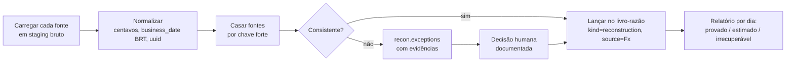

# Plano de migração e recuperação do histórico

Objetivo: reconstruir, **com prova**, o que aconteceu financeiramente no evento passado e carregar isso no novo livro-razão, deixando explícito o que foi **provado**, o que foi **estimado** e o que é **irrecuperável**.

## 0. Antes de tudo: congelar as evidências (dia 0)

O sistema antigo ainda tem funções públicas que apagam dados (S-01 a S-07). Antes de qualquer análise:

1. Aplicar as ações urgentes de `00-RESUMO-EXECUTIVO.md`, principalmente fechar `r2-backup`, `reset-*` e `cleanup-*`.
2. `pg_dump --format=custom` completo do projeto Supabase atual, guardado em 2 lugares fora do Supabase. Registrar o sha256 do arquivo.
3. Baixar **todos** os objetos do bucket R2 `ruailuminada` (prefixo `daily/`) e registrar o sha256 de cada um.
4. Pedir ao suporte do Supabase quais backups diários ou PITR ainda existem e até que data. Se o plano era Free, não há backup gerenciado; no Pro, só os 7 dias mais recentes.
5. Exportar os **logs das edge functions** (Supabase > Logs) do período do ataque: IPs, horários, funções chamadas. Serve para descobrir **qual endpoint apagou o quê**.
6. Não rodar nenhum `fix-*`, `reprocess-*` ou `cleanup-*` daqui em diante.

## 1. Fontes de verdade disponíveis (da mais confiável para a menos)

| # | Fonte | Contém | Confiabilidade | Como obter |
|---|-------|--------|----------------|------------|
| F1 | **Extratos bancários** (OFX/CSV) da conta do evento | Créditos de repasse Zet, liquidações PagBank, depósitos de dinheiro, repasses à administração | Máxima (é o dinheiro de fato) | Internet banking, período inteiro |
| F2 | **Relatório de vendas da Zet** (painel/planilha/API) | Pedido a pedido: uuid, valores, taxa, status, data | Muito alta para vendas online | Painel da Zet; o sistema já tinha `import-zet-spreadsheet` e `ocr-comprenoze` |
| F3 | **Extrato de repasses da Zet** | Quais pedidos compõem cada repasse | Muito alta | Painel ou suporte da Zet |
| F4 | **CSV do PagBank** (transações e recebíveis) | Bruto, MDR real, líquido, data de liquidação | Muito alta para cartão/PIX | Painel PagBank; o parser `pagbank-csv-parser.ts` já existe |
| F5 | **PDFs de fechamento assinados** (`closure_pdf_attachments`, storage) | Totais declarados por dia, com assinatura | Alta para o **declarado**, não para o real | Storage do Supabase |
| F6 | **Backups R2** (desde 09/12/2025) | Tabelas até 10.000 linhas cada | Média (pode estar truncado) | Bucket R2 |
| F7 | **Backup de webhooks** (`webhooks-zet-backup.zip`, 27.641 webhooks, 22/10/2025 a 04/01/2026) | Payload bruto e intacto de cada venda e estorno recebido | **Muito alta** no período coberto (valores consistentes, taxa exata; ver `09-ANALISE-WEBHOOKS-ZET.md`) | Já exportado; guardar fora do repositório (tem dados pessoais) |
| F8 | **Logs de e-mail de confirmação** (Brevo, `send-purchase-email`) | Pedido, cliente, valor, data | Média; ajuda a provar vendas cujo registro sumiu | Painel do Brevo |
| F9 | **Validações de catraca** (`access_events`, middleware) | Vouchers usados | Média; prova de que o ingresso existiu | Dump e logs do middleware |
| F10 | Arquivos `data/imports/*.json` e planilhas manuais | Importações manuais de novembro | Baixa a média | Repositório |
| F11 | Anotações físicas: contagem de caixa, borderôs | Declarado em papel | Baixa a média | Físico |

## 2. Processo de reconstrução



### 2.1 Staging (um schema `recovery`, sem regra, só dado bruto)
```sql
create schema recovery;
create table recovery.source_files (
  id bigserial primary key, source text not null, file_name text not null,
  sha256 bytea not null unique, loaded_at timestamptz default now(), notes text
);
create table recovery.rows (
  id bigserial primary key,
  file_id bigint not null references recovery.source_files(id),
  source text not null,                   -- F1..F11
  natural_key text,                       -- order_uuid, id da transação PagBank, FITID do OFX...
  business_date date,
  amount_cents bigint,
  payload jsonb not null
);
create index on recovery.rows(source, natural_key);
```

### 2.1a A primeira semana de vendas (15/10 a 21/10/2025) e o dia do apagão da AWS

As vendas online começaram em **15/10/2025**, mas o backup de webhooks só tem pedidos pagos a partir de **22/10/2025**. A primeira semana inteira, incluindo o dia do apagão, vem só do relatório da Zet (F2), do extrato de repasses (F3) e do extrato bancário (F1).

Os payloads dessa data estão **corrompidos** (valores não batem com a plataforma), então **não servem como fonte**:

1. Para essa data, a base é **só o relatório da Zet (F2)**, pedido a pedido, mais o extrato de repasses (F3) e o extrato bancário (F1).
2. Os registros do banco antigo daquela data (`zet_sales_master`, `online_sales_transactions`, `orders`, `webhook_logs`) entram apenas como **evidência** para explicar a diferença (duplicados, sobrescritos, estornos em dobro), nunca como valor.
3. Exportar do Cloudflare (Analytics/Logs de `api.ruailuminada.com`) o volume de requisições por minuto e os IPs daquele dia. Serve para saber se foi **reenvio em massa da Zet** (IPs da Zet, payloads repetidos) ou **tráfego malicioso** (IPs estranhos, payloads que não existem no relatório).
4. Pedidos que existem no banco antigo mas não no relatório da Zet daquela data: tratar como **suspeitos** (possível venda forjada, já que o webhook não tinha assinatura) até a Zet confirmar.

### 2.1b Vendas nunca gravadas pelo sistema antigo

`dados/zet-webhooks-nao-processados.csv` lista **199 compras (R$ 24.313,00 líquidos) e 9 estornos** cujo payload está no backup mas que o sistema antigo recusou ou perdeu. Recuperar processando esses payloads no novo worker, depois de conferir no relatório da Zet que não foram importados por planilha.

### 2.2 Vendas online (Zet)
1. **Base = F2** (relatório Zet), pedido a pedido.
2. Casar com F7 (payload bruto) por `order_uuid`. Se o payload existe e os valores batem, o pedido está **provado por duas fontes**.
3. Só em F2 (webhook perdido ou registro apagado): lançar com `source='zet_report'`.
3a. Estornos parciais: conferir ingresso a ingresso com o relatório da Zet. Pedidos marcados inteiros como estornados pelo sistema antigo (P-18) precisam ser reabertos para os ingressos que continuaram válidos.
4. Só em F7 ou no dump (a Zet não lista): **suspeita de venda forjada** (o webhook era aberto). Confirmar com a Zet. Sem confirmação, **não entra** na receita e vira exceção.
5. Status divergente (ex.: F2 = PAGO, banco = ESTORNADO): vale o **F2**. Registrar como exceção "possível estorno forjado".
6. Conferir que Σ líquidos por lote de repasse (F3) é igual ao crédito correspondente em F1.
7. Para cada pedido, conferir `taxa ≈ líquido × 10%` (tolerância de 1 centavo por ingresso). Registros que as funções antigas `recalculate-zet-taxes` e `fix-comprenozet-tax-calculation` alteraram devem ser restaurados **pelo valor do relatório Zet (F2)**, nunca pela fórmula.

### 2.3 Bilheteria (dinheiro e cartão)
1. Cartão/PIX: **base = F4** (PagBank). Uma transação vira um lançamento com o MDR real. Conferir a liquidação contra F1.
2. Dinheiro: não há fonte externa. Base = **F5** (PDF assinado), com o valor declarado de cada caixa e dia. Conferir com os **depósitos** em F1. A diferença acumulada entre dinheiro declarado e dinheiro depositado vira uma conta de "Caixa não depositado / a apurar".
3. Contagem de ingressos físicos (cartões inteira/meia/social) × F9 (validações): estimativa de ingressos vendidos. Serve para **sanidade**, não para valor.

### 2.4 Foods
1. Vendas declaradas pelas lojas: backups (F6) e PDFs. Se a loja tiver os próprios relatórios, pedir cópia.
2. Recalcular a comissão com a regra única (`applyRate`, meio-para-cima, 1 vez por dia e loja). **A diferença entre o recalculado e o que estava gravado** (os `185.184`) é a explicação de parte dos centavos. Documentar.
3. Repasses recebidos: F1 (créditos identificáveis por remetente/CNPJ). Alocar FIFO com o algoritmo inteiro.

### 2.5 Repasses à administração
- Base = F1 (débitos da conta do evento para a administração).

## 3. Classificação final de cada dia

| Selo | Critério |
|------|----------|
| ✅ **Provado** | Todos os valores do dia batem entre pelo menos duas fontes independentes, uma delas F1 ou F2/F4 |
| 🟡 **Estimado** | Há fonte, mas é única ou declarada (F5, F11), ou houve uma decisão humana registrada |
| 🔴 **Irrecuperável** | Não há fonte. O valor fica como "diferença não explicada", em conta própria |

O relatório de reconstrução mostra, por dia e por conta: valor, selo, fontes usadas e exceções resolvidas, com quem decidiu e por quê. **Esse documento é a sua prova diante de sócios, contador e lojistas.**

## 4. Carga no novo sistema

1. Criar o evento e o plano de contas no novo banco.
2. Para cada dia reconstruído, gerar lançamentos com `kind='reconstruction'`, `idempotency_key='recovery:<fonte>:<chave>'` e `metadata.evidence=[ids de recovery.rows]`.
3. Fechar cada dia reconstruído (`fin.periods.status='closed'`) com o hash.
4. Diferenças não explicadas entram como lançamento explícito na conta 5.9.99 "Diferenças de reconstrução", **nunca** diluídas.
5. Validar: saldo final de "Banco" no sistema = saldo do extrato F1 na data de corte. **Critério de aceite: R$ 0,00 de diferença.**

## 5. Migração do schema antigo (o que aproveitar e o que descartar)

| Tabela antiga | Destino |
|---------------|---------|
| `events`, `ticket_types`, `event_sessions`, `stores`, `staff_*` | Migrar (cadastro), com `archived_at` no lugar de delete |
| `zet_sales_master`, `webhook_logs` | Usar como **F7** na reconstrução; não migrar como verdade |
| `orders`, `online_sales`, `online_sales_transactions`, `transacoes`, `imported_sales` | Só consulta, para detectar divergências. **Não migrar** |
| `daily_closures`, `daily_closures_v2` | Só consulta (declarado). Os PDFs são a fonte |
| `store_daily_sales`, `food_repayments`, `store_cash_movements` | Migrar como **fatos** (vendas declaradas, repasses), recalculando a comissão com a regra única |
| `bank_transactions`, `imported_pagbank_transactions` | Reimportar dos arquivos originais (F1 e F4), porque as tabelas eram públicas e alteráveis |
| `access_events`, RFID, catracas | Migrar à parte (fora do núcleo financeiro) |
| Funções `fix-*`, `reprocess-*`, `cleanup-*`, `backfill-*`, `migrate-*`, `reset-*` | **Descartar** |
