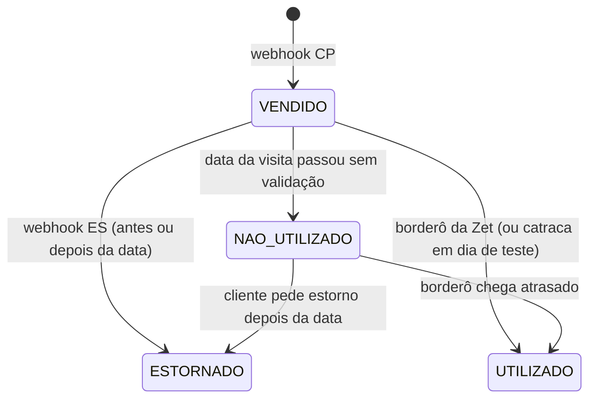

# Relatório diário e acerto de contas com a Zet

## 1. Como funciona hoje (confirmado)

- **Online**: o cliente chega com o QR Code no celular. A **equipe da Zet valida no app dela**, numa fila separada. Esses ingressos **não passam pela catraca**.
- **Catraca**: é usada pela **bilheteria** (cartões RFID). O sistema novo também aceita validar QR da Zet na catraca, mas isso só será usado em dias de teste.
- **Borderô da Zet**: no fim do dia, a Zet emite um relatório com quantos ingressos de cada tipo foram **utilizados** (validados) e os valores. Ele pode ser importado.
- **Webhook**: traz a venda, o estorno e, em cada ingresso, a **data e a sessão da visita**. **O webhook não avisa quando o ingresso é validado**: no backup, 84.067 ingressos chegaram com `used = "NAO"` (só 88 com "SIM"). A informação de entrada online tem de vir do **borderô** (ou de uma API de validações da Zet, se existir).

## 2. As fontes de cada informação

| Informação | Fonte | Data que vale |
|---|---|---|
| Vendas online (valor, tipo, data da visita) | Webhook CP | Pagamento |
| Estornos online | Webhook ES | Estorno |
| Entradas online (quem foi validado) | **Borderô da Zet**, importado todo dia (por voucher, se disponível; senão, por tipo) | Visita |
| Vendas da bilheteria | Guichês (sessões de caixa) | Venda = visita |
| Entradas da bilheteria | Catraca (cartão RFID com tipo) | Visita |
| Dinheiro recebido | Extrato bancário, API EDI PagBank | Crédito |

**Pedido à Zet**: o borderô **por voucher** (código do voucher + data e hora da validação), e não só o total por tipo. É isso que permite saber, ingresso por ingresso, quem entrou, quem não veio e quem comprou em outro dia.

## 3. O relatório de fechamento do dia (layout proposto)

### A. Financeiro do dia (o que as duas pessoas assinam)
| Linha | Quantidade | Valor |
|---|---|---|
| Bilheteria: vendas por guichê e meio de pagamento (dinheiro, cartão, PIX) | ingressos | R$ |
| Online: vendas do dia (pela data do pagamento), líquido para o evento | ingressos | R$ |
| Online: estornos do dia (pela data do estorno; inclui estornos de ingressos para datas passadas) | ingressos | R$ |
| **Venda líquida do dia** (bilheteria + online − estornos) | | **R$** |
| Comissões recebidas das lojas, sangrias, despesas, repasses recebidos | | R$ |

### B. Público do dia (informativo)
| Linha | Inteira | Meia | Social | Gazeta | Cortesia | Total |
|---|---|---|---|---|---|---|
| Entradas bilheteria (catraca RFID) | | | | | | |
| Entradas online (borderô) | | | | | | |
| ↳ compradas **hoje** | | | | | | |
| ↳ compradas **em dias anteriores** | | | | | | |
| **Total de pessoas no evento** | | | | | | |
| Online com visita hoje que **não** foram validados (no-show ou falha de validação) | | | | | | |

### C. Ticket médio (calculado sobre o público que entrou)

**Regra confirmada:** o ticket médio oficial é calculado sobre **quem entrou no dia** e o **valor efetivamente pago por esses ingressos**. Mostra a efetividade do público presente.

| Indicador | Fórmula |
|---|---|
| **Ticket médio geral do dia** | Σ valor pago pelos ingressos **utilizados** no dia (bilheteria + online) ÷ pessoas que entraram |
| Ticket médio da bilheteria | Σ valor dos cartões RFID que entraram no dia ÷ entradas da bilheteria. Como a bilheteria vende e entra no mesmo dia, é praticamente a receita da bilheteria ÷ entradas |
| Ticket médio online | Σ valor líquido dos vouchers **validados** no dia (valor real de cada voucher, mesmo que comprado dias antes) ÷ vouchers validados |
| Com e sem cortesia | Mostrado das duas formas: cortesia é uma pessoa que entrou com valor zero, então puxa a média para baixo |
| Mix de tipos | % de inteira, meia, social, Gazeta e cortesia **entre quem entrou** |

Isso só é possível porque o sistema guarda o **valor pago em cada ingresso** (rateado pelo preço de tabela, já com desconto de campanha) e a validação de cada voucher (borderô por voucher). Se o borderô vier só por tipo, o valor online usa o preço pago médio de cada tipo naquele dia de visita, e o relatório sinaliza que é aproximado.

A **venda média do dia** (líquido vendido ÷ ingressos vendidos; ex.: 20/12/2025 = R$ 27,59 no online) continua disponível, mas como indicador **comercial**, separado do ticket médio.

### D. Previsão de público (a partir dos webhooks)
Ingressos online **válidos** (vendidos − estornados) por data de visita, para os próximos dias, com o histórico de comparecimento para estimar quantos virão. Exemplo real, com o que já tinha sido vendido até 20/12/2025:

| Data da visita | Ingressos online já vendidos |
|---|---|
| 21/12 | 890 |
| 22/12 | 577 |
| 23/12 | 403 |

Os números aumentam a cada venda. A tela mostra em tempo real, por sessão e tipo, para planejar equipe, abertura de guichês e lotação.

## 4. Ciclo de vida de cada ingresso online



Cada ingresso guarda: `voucher`, `order_uuid`, tipo, sessão, **data da visita**, valor líquido pago (rateado), **data da venda**, estado, data do estorno, data e fonte da validação.

## 5. O acerto final com a Zet ("conta-corrente Zet")

No fim do evento (e a qualquer momento durante), o sistema emite um extrato que responde "Zet, você me deve tanto":

| Linha | Ingressos | Valor líquido |
|---|---|---|
| (+) Vendas online (todas, pela data do pagamento) | | R$ |
| (−) Estornos | | R$ |
| **(=) Devido pela Zet ao evento** | | **R$** |
| (−) Repasses já recebidos (extrato bancário, com data e valor de cada um) | | R$ |
| **(=) Saldo a receber da Zet** | | **R$** |
| Divergências em aberto (pedido que só existe de um lado, valor diferente, taxa errada) | | R$ |

Anexos do extrato, pedido a pedido:
- vendas que estão no relatório da Zet e não no sistema (e o contrário);
- estornos por data;
- **ingressos vendidos e não utilizados** (voucher, tipo, data da visita, valor). Para cada um, a Zet precisa dizer se foi **no-show** (o dinheiro fica com o evento) ou **falha de validação** (a pessoa entrou e a equipe não validou). Os dois casos continuam sendo receita do evento: ingresso vendido e não estornado é dinheiro do evento, tenha a pessoa entrado ou não.

O valor **definitivo** só existe depois do prazo máximo de estorno e contestação (seção 6). Até lá, o extrato mostra também o **valor em risco**: vendas que ainda podem ser estornadas.

## 6. Prazo de estorno: quando o dinheiro fica definitivamente com o evento

O que os dados mostram (228 estornos do backup): o estorno acontece, na mediana, **1 dia depois da compra**, e o maior prazo foi **17 dias**. **63 estornos aconteceram depois da data da visita.** Ou seja, um dia já fechado pode "perder" dinheiro depois; por isso o estorno é lançado **na data do estorno**, e não reabrindo o dia da venda.

Existem três prazos diferentes, e é preciso saber os três:

| Prazo | O que é | De onde vem |
|---|---|---|
| Política de cancelamento da Zet | Até quando o cliente pode pedir o estorno pela plataforma (ex.: até X horas antes da sessão) | **Contrato e termos da Zet**: pedir por escrito |
| Direito de arrependimento | Compra fora do estabelecimento (internet) pode ser cancelada em até 7 dias (CDC, art. 49); há discussão sobre como se aplica a ingressos com data marcada | **Confirmar com o jurídico** e com a Zet como ela aplica |
| Contestação no cartão (chargeback) e devolução no PIX | O titular pode contestar a compra no banco depois do prazo da Zet; no PIX existe o Mecanismo Especial de Devolução para fraude | Regras das bandeiras e do Banco Central; **confirmar com a Zet** quem arca com esse custo e por quanto tempo ela retém valores |

O sistema calcula, por pedido, a data a partir da qual ele **não pode mais ser estornado pela política da Zet**, e mostra no extrato: valor já definitivo × valor ainda em risco. O prazo é um parâmetro do evento, preenchido quando a Zet confirmar.

## 7. Tabelas e visões (complemento a `04-INTEGRACAO-ZET.md`)

```sql
-- cada ingresso online, com as duas datas e o estado
alter table sales.zet_order_items
  add column visit_date     date,        -- eventsValues.eventsDates.startDate
  add column session_label  text,        -- eventsValues.session
  add column category       text,        -- inteira, meia, social, gazeta, cortesia...
  add column sold_on        date,        -- dia operacional do pagamento
  add column refunded_on    date,        -- dia operacional do estorno
  add column used_at        timestamptz, -- validação (borderô ou catraca)
  add column used_source    text check (used_source in ('zet_painel','zet_bordero','catraca','zet_api'));

-- borderô importado (por voucher quando a Zet fornecer; senão, por tipo)
create table recon.zet_bordero_lines (
  id            bigserial primary key,
  import_id     bigint not null references recon.statement_imports(id),
  visit_date    date not null,
  voucher       text,            -- preenchido quando o borderô vier por voucher
  category      text not null,
  used_qty      int not null default 1,
  amount_cents  bigint,
  raw           jsonb not null
);

-- A. vendas online do dia (financeiro)
create view recon.v_online_sales_by_day as
select sold_on as day, category, count(*) as tickets, sum(net_cents) as net_cents
  from sales.zet_order_items group by 1, 2;

-- A. estornos online do dia (financeiro)
create view recon.v_online_refunds_by_day as
select refunded_on as day, category, count(*) as tickets, sum(net_cents) as net_cents
  from sales.zet_order_items where refunded_on is not null group by 1, 2;

-- B. público online por dia de visita: esperado, entrou (hoje / antes), não utilizado
create view recon.v_online_attendance_by_day as
select visit_date as day, category,
       count(*) filter (where status <> 'cancelled')                                        as expected,
       count(*) filter (where used_at is not null)                                          as used,
       count(*) filter (where used_at is not null and sold_on =  visit_date)                as used_bought_same_day,
       count(*) filter (where used_at is not null and sold_on <  visit_date)                as used_bought_before,
       count(*) filter (where used_at is null and status <> 'cancelled')                    as not_used
  from sales.zet_order_items group by 1, 2;

-- 5. conta-corrente Zet
create view recon.v_zet_account as
select
  (select coalesce(sum(net_cents), 0) from sales.zet_order_items)                                 as sold_cents,
  (select coalesce(sum(net_cents), 0) from sales.zet_order_items where refunded_on is not null)   as refunded_cents,
  (select coalesce(sum(amount_cents), 0) from recon.statement_lines
    where source = 'bank' and description ilike '%zet%')                                           as received_cents;
-- saldo = sold − refunded − received. Na prática, os repasses são identificados pela conciliação
-- (recon.matches), não por texto; o filtro por descrição é só ilustrativo.
```
