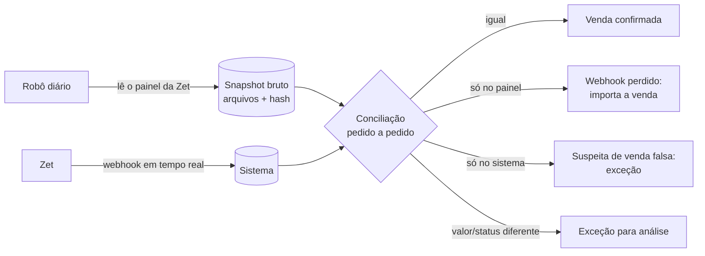

# Robô do painel administrativo da Zet

## 1. Por que faz sentido

O webhook sozinho não garante que nada se perde: o backup mostra **199 vendas pagas que o sistema antigo nunca gravou**, e a primeira semana de vendas (15/10 a 21/10/2025) nem está no backup. O painel administrativo da Zet é a **fonte da própria Zet** e tem as vendas, os estornos, o borderô de validações e os relatórios.

Um robô que entra no painel todo dia e baixa essas informações fecha o ciclo:

É o "pull de conciliação" previsto em `04-INTEGRACAO-ZET.md`, feito pelo painel enquanto a Zet não oferece uma API.

## 2. Cuidados antes de ligar o robô

| Cuidado | Por quê | O que fazer |
|---|---|---|
| **Autorização da Zet** | ✅ **Confirmada**: a Zet autorizou e forneceu login e senha de teste. | Guardar a autorização (e-mail) junto da documentação do evento. Continuar pedindo export/API oficial, que é a solução mais robusta. |
| **Credenciais** | O robô entra com usuário e senha de um painel que mostra dinheiro e dados de clientes. | Login de teste já fornecido. Guardar **só** como segredo do ambiente (`ZET_PANEL_URL`, `ZET_PANEL_USER`, `ZET_PANEL_PASSWORD`), nunca no código, no repositório, em planilha ou em mensagem. Em produção, usuário exclusivo do robô, só leitura. |
| **Botões perigosos** | O painel tem **Solicitar saque**, **Nova venda** e **Validar** ingresso, e a conta usada no teste é a do dono do evento. | O robô só lê: lista de botões permitidos (navegação, filtros, Exportar); aborta diante de formulário ou confirmação inesperada. A "baixa" dos validados é feita no nosso sistema, lendo a data de uso, **nunca** clicando em Validar. Usuário só de leitura antes da produção. |
| **Carga no site da Zet** | Depois do incidente, não podemos ser a causa de um problema do outro lado. | 1 execução por dia (madrugada) + execuções manuais; poucas páginas por minuto; sem paralelismo agressivo. |
| **LGPD** | O painel tem nome, CPF, e-mail e telefone. | Trazer só os campos necessários para conciliar; dados pessoais guardados com acesso restrito e prazo de retenção definido. |
| **Fragilidade** | Se a Zet mudar o layout, o robô quebra. | A tela geral de Vendas não exporta, mas **as telas do evento exportam** (Transações, Lista de ingressos, Extrato; ver `14-MAPEAMENTO-PAINEL-ZET.md`). O robô baixa os exports; ler a tela (seção 3a) é plano B. Validar o formato a cada execução; se algo mudar, **falhar e alertar**, nunca importar dado pela metade. |
| **Evidência** | Para cobrar a Zet, é preciso provar o que o painel mostrava. | Guardar cada arquivo baixado (ou a página) com data, hora e hash, em armazenamento imutável. |

## 3. O que o robô traz, por página do painel

| Página / relatório | Uso no sistema |
|---|---|
| Lista de pedidos / vendas | Conciliação com os webhooks CP: pedidos faltando, valores, taxa |
| Estornos / cancelamentos | Conciliação com os webhooks ES, inclusive estorno parcial |
| Borderô / validações | Entradas online do dia (`used_at` por voucher), para o público e o ticket médio |
| Financeiro / repasses | Agenda e composição dos repasses, para o acerto com a Zet e a conciliação bancária |
| Outros relatórios (por sessão, por tipo) | Conferência cruzada e previsão de público |

A lista final depende das páginas e exportações que existem no painel (ver perguntas na seção 6).

## 3a. Plano B: ler a listagem na tela (se o export falhar)

Duas técnicas, nesta ordem de preferência:

1. **Capturar os dados que a própria página carrega.** Painéis modernos buscam a listagem num endpoint interno em JSON e só depois desenham a tabela. O robô abre a página logado e **registra essas respostas JSON** (pelo navegador automatizado), em vez de ler o HTML. Vantagens: vem com todos os campos (inclusive o `uuid`, se existir), não depende do layout e não erra na leitura de valores formatados ("R$ 1.234,56").
2. **Ler a tabela da página** (se não houver JSON): percorrer todas as páginas da listagem (ou filtrar por dia), ler linha a linha e converter valores com o `parseBRL` de `money.ts`.

Em qualquer das duas, **provar que leu tudo**:
- comparar a quantidade de linhas lidas com o total que o painel mostra (ex.: "1.234 pedidos"), e a soma dos valores com o total da página, se houver;
- ler por **janela de data** (dia a dia), para que cada execução seja pequena e repetível;
- se a contagem não bater, a importação daquele dia é **descartada** e gera alerta; nada entra pela metade.

## 4. Como o sistema usa o que o robô traz

1. Cada execução gera um **lote de importação** (`recon.statement_imports`, com o hash dos arquivos) e linhas em `recon.statement_lines` com `source = 'zet_panel'` (vendas e estornos) ou `'zet_bordero'` (validações).
2. A conciliação compara pedido a pedido pelo `order.uuid` (ou pelo número do pedido):

| Situação | Ação automática |
|---|---|
| Pedido igual no painel e no sistema | Marca a venda como **confirmada pela Zet** |
| Pedido **só no painel** (webhook perdido) | Cria a venda pelo mesmo fluxo do webhook, com origem `zet_panel`, e registra no relatório do dia |
| Pedido **só no sistema** | Exceção "venda sem confirmação da Zet" (possível envio falso, como o teste do Postman que entrou como venda real) |
| Estorno no painel sem webhook ES | Aplica o estorno (por voucher) com origem `zet_panel` |
| Valor ou taxa diferente | Exceção para análise; **nunca** sobrescreve sozinho (lembrando o caso da taxa errada da meia-entrada) |
| Voucher validado no borderô | Preenche `used_at` e `used_source = 'zet_bordero'` |

3. O painel **complementa** o webhook, não o substitui: o webhook continua sendo o registro em tempo real; o robô é a conferência diária e a rede de segurança.

## 5. Onde o robô roda

- Um navegador automatizado (Playwright, sem interface) rodando num **agendador fora do banco**: um worker pequeno ou um job agendado. Não roda dentro das edge functions do Supabase, que não comportam um navegador.
- Fluxo: login → navega até cada relatório → exporta ou lê → salva os arquivos com hash → envia para uma função de importação autenticada (com papel próprio de "importador").
- Monitoramento: alerta se o robô não rodar, se o login falhar, se o formato mudar ou se a conciliação encontrar mais de N divergências.

## 6. Próximos passos

1. Cadastrar as credenciais de teste como **segredos do ambiente** (`ZET_PANEL_URL`, `ZET_PANEL_USER`, `ZET_PANEL_PASSWORD`). Nunca enviar senha por mensagem.
2. Com os segredos, fazer um **mapeamento só de leitura** do painel: telas, filtros, paginação e se a listagem vem de um endpoint JSON.
3. Escrever o robô e testá-lo contra o backup de webhooks (22/10/2025 a 04/01/2026): o painel tem de mostrar os mesmos 26.111 pedidos e os mesmos valores, mais os que o webhook perdeu.

## 7. Perguntas ainda abertas

1. ~~Exportação~~ Transações, Lista de ingressos e Extrato do evento exportam (`14-MAPEAMENTO-PAINEL-ZET.md`). Falta saber o formato e se há filtro por data.
2. ~~Captcha/2FA~~ Não aparece no vídeo: login só com e-mail e senha.
3. Em produção, haverá um **usuário só de leitura** para o robô?
4. ~~Autorização~~ Confirmada.
5. ~~Mesmo uuid?~~ Sim: Transações e Extrato mostram o `order.uuid` do webhook, e a Lista de ingressos mostra o `voucher`.
