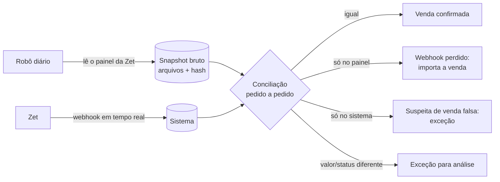

# Robô do painel administrativo da Zet

## 1. Por que faz sentido

O webhook sozinho não garante que nada se perde: o backup mostra **199 vendas pagas que o sistema antigo nunca gravou**, e a primeira semana de vendas (15/10 a 21/10/2025) nem está no backup. O painel administrativo da Zet é a **fonte da própria Zet** e tem as vendas, os estornos, o borderô de validações e os relatórios.

Um robô que entra no painel todo dia e baixa essas informações fecha o ciclo:

É o "pull de conciliação" previsto em `04-INTEGRACAO-ZET.md`, feito pelo painel enquanto a Zet não oferece uma API.

## 2. Cuidados antes de ligar o robô

| Cuidado | Por quê | O que fazer |
|---|---|---|
| **Autorização da Zet** | O painel não ter bloqueio técnico não significa que o uso automatizado é permitido. Os termos de uso podem proibir, e um bloqueio da conta no meio do evento seria grave. | Avisar a Zet e pedir **autorização por escrito**. Aproveitar para pedir export/API oficial (a melhor solução). |
| **Credenciais** | O robô entra com usuário e senha de um painel que mostra dinheiro e dados de clientes. | Usuário **exclusivo do robô**, só leitura, se a Zet permitir; senha no cofre de segredos; nunca no código nem em planilha. Se houver 2FA, tratar com a Zet. |
| **Carga no site da Zet** | Depois do incidente, não podemos ser a causa de um problema do outro lado. | 1 execução por dia (madrugada) + execuções manuais; poucas páginas por minuto; sem paralelismo agressivo. |
| **LGPD** | O painel tem nome, CPF, e-mail e telefone. | Trazer só os campos necessários para conciliar; dados pessoais guardados com acesso restrito e prazo de retenção definido. |
| **Fragilidade** | Se a Zet mudar o layout, o robô quebra. | Preferir os **botões de exportar** (CSV/Excel) a ler HTML; validar o formato a cada execução; se algo mudar, **falhar e alertar**, nunca importar dado pela metade. |
| **Evidência** | Para cobrar a Zet, é preciso provar o que o painel mostrava. | Guardar cada arquivo baixado (ou a página) com data, hora e hash, em armazenamento imutável. |

## 3. O que o robô traz, por página do painel

| Página / relatório | Uso no sistema |
|---|---|
| Lista de pedidos / vendas | Conciliação com os webhooks CP: pedidos faltando, valores, taxa |
| Estornos / cancelamentos | Conciliação com os webhooks ES, inclusive estorno parcial |
| Borderô / validações | Entradas online do dia (`used_at` por voucher), para o público e o ticket médio |
| Financeiro / repasses | Agenda e composição dos repasses, para o acerto com a Zet e a conciliação bancária |
| Outros relatórios (por sessão, por tipo) | Conferência cruzada e previsão de público |

A lista final depende das páginas e exportações que existem no painel (ver perguntas na seção 6).

## 4. Como o sistema usa o que o robô traz

1. Cada execução gera um **lote de importação** (`recon.statement_imports`, com o hash dos arquivos) e linhas em `recon.statement_lines` com `source = 'zet_panel'` (vendas e estornos) ou `'zet_bordero'` (validações).
2. A conciliação compara pedido a pedido pelo `order.uuid` (ou pelo número do pedido):

| Situação | Ação automática |
|---|---|
| Pedido igual no painel e no sistema | Marca a venda como **confirmada pela Zet** |
| Pedido **só no painel** (webhook perdido) | Cria a venda pelo mesmo fluxo do webhook, com origem `zet_panel`, e registra no relatório do dia |
| Pedido **só no sistema** | Exceção "venda sem confirmação da Zet" (possível envio falso, como o teste do Postman que entrou como venda real) |
| Estorno no painel sem webhook ES | Aplica o estorno (por voucher) com origem `zet_panel` |
| Valor ou taxa diferente | Exceção para análise; **nunca** sobrescreve sozinho (lembrando o caso da taxa errada da meia-entrada) |
| Voucher validado no borderô | Preenche `used_at` e `used_source = 'zet_bordero'` |

3. O painel **complementa** o webhook, não o substitui: o webhook continua sendo o registro em tempo real; o robô é a conferência diária e a rede de segurança.

## 5. Onde o robô roda

- Um navegador automatizado (Playwright, sem interface) rodando num **agendador fora do banco**: um worker pequeno ou um job agendado. Não roda dentro das edge functions do Supabase, que não comportam um navegador.
- Fluxo: login → navega até cada relatório → exporta ou lê → salva os arquivos com hash → envia para uma função de importação autenticada (com papel próprio de "importador").
- Monitoramento: alerta se o robô não rodar, se o login falhar, se o formato mudar ou se a conciliação encontrar mais de N divergências.

## 6. Perguntas para montar o robô

1. Quais páginas e relatórios existem no painel (vendas, estornos, borderô, financeiro/repasses)? Algum tem **botão de exportar** (CSV/Excel/PDF)?
2. O login tem captcha ou verificação em duas etapas?
3. É possível criar um **usuário só de leitura** para o robô?
4. A Zet autoriza o acesso automatizado? (Pedir por escrito; e, junto, perguntar se há API oficial.)
5. O painel mostra o pedido com o mesmo `uuid` do webhook, ou só o número do pedido?
