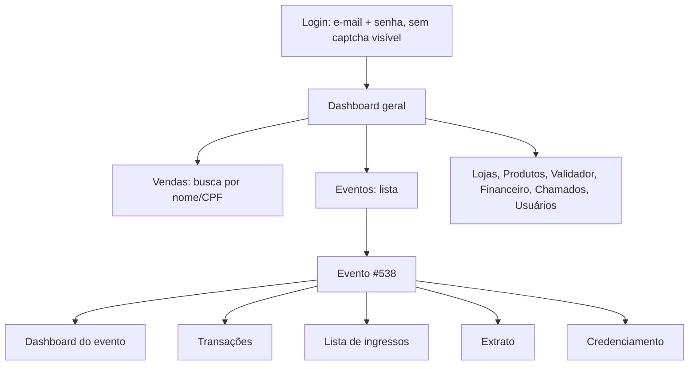

# Mapeamento do painel da Zet (a partir do vídeo de 26/09/2026)

Fonte: gravação de tela do painel `app.comprenozet.com.br`, feita pelo dono do evento, logado com a conta do evento. Evento **#538, "Rua Iluminada Família Moletta 2025"**, o mesmo `event.id` que chega no webhook. Nomes, CPFs e e-mails que aparecem no vídeo **não** foram copiados para este documento.

## 1. Mapa das telas

| Tela | O que mostra | Exportar? | Uso na conciliação |
|---|---|---|---|
| **Dashboard geral** | Pedidos, ingressos, faturamento bruto, ticket médio por pedido, meios de pagamento, previsão de visitas, presentes, ausentes, validações hora a hora por dia, últimos pedidos, análise de público | Não | Totais de controle (seção 3) |
| **Vendas** (menu Transações) | Busca por nome ou CPF; não lista nada sem busca | Não | Nenhum. O robô usa a tela de Transações do evento |
| **Evento → Dashboard** | Ingressos, receita bruta, **receita líquida**, cortesias, ingressos por meio de pagamento (**online** e **máquina**), vendidos por data, **Borderô de contestações** (exportável), **taxa do evento** | Borderô de contestações | Totais de controle; contestações |
| **Evento → Transações** | Um pedido por linha: `uuid`, nome, total, data da compra, tipo, situação | **Sim** (botão Exportar) | Conciliação pedido a pedido com os webhooks CP/ES |
| **Evento → Lista de ingressos** | Um voucher por linha: voucher, comprador, documento, data da compra, data do evento, usado (SIM ou botão **Validar**), setor, descrição, sessão, **data e hora de uso**; totais de validados e pendentes | **Sim** | **Entradas online por voucher** (substitui o borderô por tipo) |
| **Evento → Extrato** | Saldo para saque, saldo a liberar, e o extrato linha a linha (crédito de cada venda, contestações, saques, taxas de saque) | **Sim** (ícone) | **Conta-corrente com a Zet**: o que a Zet deve e o que já pagou |
| **Evento → Credenciamento** | Busca de voucher; configuração | Não | Nenhum |

**Correção importante:** a tela geral de Vendas não exporta, mas **as telas do evento exportam** (Transações, Lista de ingressos e Extrato). O robô deve **baixar esses arquivos** em vez de ler a tabela na tela. Isso é mais rápido, mais leve para o site da Zet e menos sujeito a erro. Ler a tela fica só como plano B.

## 2. Campos de cada tela

### 2.1 Transações (1.535 páginas na tela)
| Coluna | Exemplo | Casa com o webhook |
|---|---|---|
| ID | `a89751fe-9deb-4dd4-…` | `order.uuid` ✅ (confirmado: o pedido 198284 do webhook tem esse uuid) |
| Total | R$ 39,60 | `order.totalValue` (preço + taxa) |
| Data da compra | 04/01/2026 20:36 | `order.createdAt` em horário de Brasília (o webhook vem em UTC: 23:36Z) |
| Tipo | `PIX`, `CREDITO`, **`PIX_MAQUINA`**, **`CREDITO_MAQUINA`** | `order.paymentType` |
| Situação | `PAGO`, `CANCELADO` | `paymentSituation` / webhook ES |

### 2.2 Lista de ingressos
Totais no topo: **76.870 validados** e **5.822 pendentes**. Cada linha tem o **voucher** (o mesmo `voucher` do webhook), a sessão, a descrição do tipo e a **data e hora de uso**. É o dado que faltava: o webhook não avisa a validação (`used = "NAO"` em 84.067 ingressos do backup). Com esta tela, cada voucher recebe `used_at` e `used_source = 'zet_painel'`.

### 2.3 Extrato
| Linha | Exemplo | Significado |
|---|---|---|
| `Parcela 1/1 venda <uuid>` | ONLINE, **R$ 36,00**, liberação 04/01/2026 | Crédito do **valor líquido** da venda. Pedido 198284: R$ 39,60 − taxa R$ 3,60 = **R$ 36,00** ✅ |
| `Parcela 1/1 venda <uuid>` | **FISICO**, R$ 18,00 | Venda na **máquina da Zet**: R$ 19,80 − 10% = R$ 18,00. A taxa de 10% também incide na venda física |
| `Chargeback Parcela 1/1 venda <uuid>` | −R$ 72,00 | Contestação: o valor líquido volta a ser debitado do evento |
| `Solicitação de saque` | −R$ 41.905,50 (05/01/2026); −R$ 4.513,50 (07/01/2026) | Repasse ao evento (deve casar com o extrato bancário) |
| `Taxa de saque` | −R$ 4,00 por saque | Custo do repasse (despesa do evento) |

O extrato tem 1.403 páginas e abas Todos / Crédito / Débito.

## 3. Números do painel (totais de controle)

| Indicador | Painel | Observação |
|---|---|---|
| Pedidos (dashboard geral, 01/10/2025 a 11/01/2026) | 27.370 | Webhooks no backup: 26.111 pedidos (a partir de 22/10) |
| Ingressos | 82.413 (geral) / 82.433 (evento, 06/10/2025 a 05/01/2026) | Os dois painéis diferem em 20 ingressos: períodos ou critérios diferentes. **Perguntar à Zet** |
| Ingressos online | PIX 57.177 + crédito 22.580 = **79.757** | Backup: PIX 57.084 + crédito 22.438. A diferença é esperada (a primeira semana não está no backup) e será explicada pedido a pedido |
| Ingressos na **máquina da Zet** | PIX 491 + débito 1.123 + crédito 783 = **2.397** | **Nenhum** chegou por webhook |
| Cortesias | 259 | |
| Receita bruta / líquida | R$ 2.355.379,05 / R$ 2.141.253,70 | Líquida × 1,10 = R$ 2.355.379,07: **2 centavos** de diferença entre os dois totais da própria Zet (arredondamento por pedido). Mostra por que a conciliação é por pedido, em centavos |
| Previsão de visitas / presentes / ausentes | 82.692 / 76.870 / 5.822 | 76.870 + 5.822 = 82.692 ✅ |
| Taxa do evento | 10% + R$ 0,00, taxa mínima R$ 0,00 | Confirma a regra R4 |
| Saldo para saque imediato | **−R$ 975,00** | Ver seção 4 |

## 4. Achado: R$ 975,00 em contestações que o webhook nunca avisou

O extrato mostra **13 contestações (chargebacks)**. A soma é **R$ 975,00, exatamente o saldo negativo do evento na Zet**: depois dos saques, a Zet debitou as contestações e o evento ficou devendo esse valor.

| Venda (início do uuid) | Pago em | Meio | Total do pedido | Debitado | Liberação |
|---|---|---|---|---|---|
| `c8749188` | 20/11/2025 | Crédito | R$ 47,30 | −R$ 43,00 | 06/02/2026 |
| `6486c1fb` | 21/11/2025 | PIX | R$ 118,80 | −R$ 108,00 | 30/06/2026 |
| `45b662db` | 22/11/2025 | PIX | R$ 138,60 | −R$ 126,00 | 30/06/2026 |
| `0a46cc94` | 26/11/2025 | Crédito | R$ 59,40 | −R$ 54,00 | 25/01/2026 |
| `61f6f76a` | 29/11/2025 | PIX | R$ 99,00 | −R$ 90,00 | 30/06/2026 |
| `b93cc379` | 29/11/2025 | PIX | R$ 79,20 | −R$ 72,00 | 30/06/2026 |
| `51dcbd77` | 29/11/2025 | PIX | R$ 79,20 | −R$ 72,00 | 30/06/2026 |
| `ace25ce9` | 30/11/2025 | PIX | R$ 79,20 | −R$ 72,00 | 30/06/2026 |
| `856196a5` | 01/12/2025 | PIX | R$ 79,20 | −R$ 72,00 | 30/06/2026 |
| `a7d6beba` | 03/12/2025 | PIX | R$ 55,00 | −R$ 50,00 | 30/06/2026 |
| `57066091` | 04/12/2025 | PIX | R$ 59,40 | −R$ 54,00 | 30/06/2026 |
| `d397c0a9` | 04/12/2025 | PIX | R$ 79,20 | −R$ 72,00 | 30/06/2026 |
| `209d74f7` | 05/12/2025 | PIX | R$ 99,00 | −R$ 90,00 | 30/06/2026 |
| **Total** | | | | **−R$ 975,00** | |

Conferido contra o backup:
- as 13 vendas estão no backup como **CP pago**, e **nenhuma tem webhook ES**. **A Zet não avisa contestação por webhook**; só o extrato mostra;
- o valor debitado é sempre o **líquido** (total − taxa), igual ao crédito original. A taxa da Zet não volta ao evento;
- 11 das 13 são **PIX**: devolução pelo Mecanismo Especial de Devolução (MED), usado em suspeita de fraude ou golpe. As outras 2 são cartão de crédito;
- as contestações foram lançadas depois dos saques de janeiro de 2026, meses depois da compra. Isso confirma o que estava em `12-RELATORIO-DIARIO-E-ACERTO-ZET.md`, seção 6: **o dinheiro de uma venda só é definitivo depois do prazo de contestação**.

**Consequências no sistema novo:**
1. O extrato da Zet vira fonte obrigatória: cada linha `Chargeback` gera um lançamento `D 4.9.03 Contestações (dedução de receita) / C 1.2.01 A receber Zet` **na data em que aparece**, sem reabrir o dia da venda. Os ingressos do pedido passam ao estado `CONTESTADO`.
2. A conta "A receber Zet" pode ficar **negativa** (o evento deve à Zet). O relatório tem de mostrar isso claramente.
3. Se algum voucher contestado **já tinha sido usado** (Lista de ingressos), a pessoa entrou e o evento perdeu o valor. Esses casos entram no relatório de fraude, para decidir se vale contestar com a Zet.

## 5. Achado: vendas na máquina da Zet (`PIX_MAQUINA`, `CREDITO_MAQUINA`, `DEBITO_MAQUINA`)

> Atualização: o export de Transações confirmou **1.161 pedidos, R$ 60.952,50 líquidos**, e o robô vai importá-los. Ver `15-IMPORTACAO-EXPORT-ZET.md`.

Foram 2.397 ingressos vendidos em **máquinas da própria Zet**, com tipo `FISICO` no extrato e taxa de 10%. Nenhum veio por webhook: o backup só tem `PIX`, `CREDITO`, `CORTESIA` e `CREDITO_LINK`. Nos exemplos do vídeo (R$ 19,80, sem nome do comprador), parecem vendas de balcão.

**Dúvida para o dono do evento:** quem operava essas máquinas e onde? Se foram vendas da bilheteria feitas na máquina da Zet, esse dinheiro **não passa pelo caixa do guichê nem pelo PagBank**: vem pelo repasse da Zet. O sistema precisa de um canal próprio, "Zet máquina", para não contar duas vezes nem deixar de contar.

## 6. Como o robô usa cada tela

| Ordem | Tela | Ação do robô | Destino no sistema |
|---|---|---|---|
| 1 | Evento → Transações | Exportar (filtrar pela data de ontem, se o filtro existir) | `recon.statement_lines` (`source = 'zet_panel'`), casamento por `order.uuid` |
| 2 | Evento → Lista de ingressos | Exportar | `sales.zet_order_items.used_at`, `used_source = 'zet_painel'` |
| 3 | Evento → Extrato | Exportar | `recon.zet_statement_lines`: créditos, contestações, saques e taxas |
| 4 | Evento → Dashboard | Ler os cartões de total (sem exportar) | Totais de controle da execução: a soma do que foi importado tem de bater com o painel |
| 5 | Evento → Dashboard | Exportar o Borderô de contestações | Evidência das contestações |
| 6 | Evento → Transações → **Detalhes** (ⓘ) | Abrir só os pedidos sem itens (máquina da Zet, webhook perdido) e ler os vouchers: tipo (meia, inteira…), sessão e data | `sales.zet_order_items`, com `source = 'zet_painel'` (`15-IMPORTACAO-EXPORT-ZET.md`, seção 3) |

**O robô só lê.** No painel existem botões que **mexem em dinheiro e em ingressos**: **Solicitar saque**, **Nova venda** e **Validar** (na Lista de ingressos). O robô:
- não clica em nada além de navegação, filtros e Exportar, com uma **lista de botões permitidos** no código;
- **nunca** valida ingresso nem altera nada no painel da Zet (regra R27, confirmada pelo dono do evento). A "baixa" dos validados é feita **no nosso sistema**, lendo a coluna "data de uso" da Lista de ingressos, e não no painel da Zet. Validar um voucher pelo robô registraria como presente uma pessoa que não entrou;
- aborta se a página mostrar um formulário ou uma confirmação inesperada.

**Conta do robô:** o vídeo foi feito com a conta do dono do evento, que pode solicitar saque. Um robô com essa senha poderia sacar dinheiro, se tivesse um erro ou fosse invadido. **Pedir à Zet um usuário só de leitura**, sem saque, sem nova venda e sem validação, antes de colocar o robô em produção. Enquanto isso não existir, o robô roda apenas manualmente, acompanhado.

## 7. Novas perguntas para a Zet

1. Existe um **usuário só de leitura** (sem saque, venda ou validação)?
2. Por que o dashboard geral mostra 82.413 ingressos e o do evento, 82.433?
3. Por que as contestações de PIX têm data de liberação **30/06/2026**? Esse valor já foi descontado ou ainda será?
4. Quais são os prazos para contestação (PIX MED e cartão) e o que acontece depois do fim do evento?
5. A Zet pode enviar contestações por webhook (ex.: ação `CB`)?
6. O export de Transações aceita filtro por data? Qual é o formato (xlsx ou csv) e as colunas?
7. As máquinas da Zet (`*_MAQUINA`) serão usadas de novo? Podem enviar webhook?
