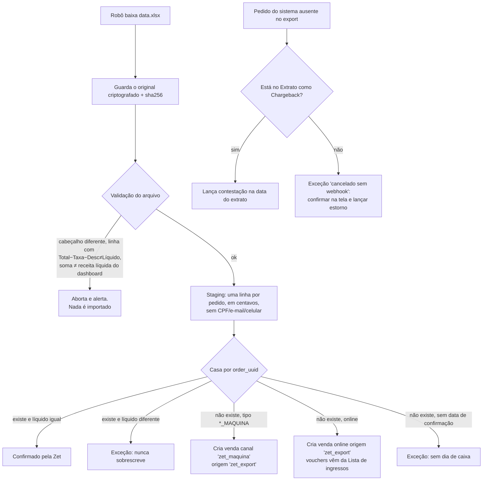

# Importação do export de Transações da Zet

Fonte: arquivo `data.xlsx` baixado pelo botão **Exportar** da tela Evento → Transações (evento #538), analisado em 26/09/2026. O arquivo tem **dados pessoais** (nome, CPF, e-mail, celular) e **não** foi versionado. Só os agregados e os `order_uuid` estão em `dados/zet-export-x-webhooks.csv` e `dados/zet-maquina-por-dia.csv`.

## 1. O arquivo

| Item | Valor |
|---|---|
| Planilha | `Relatório`, 27.451 linhas + cabeçalho, uma linha por **pedido** |
| Colunas | `ID` (= `order.uuid`), `Nome`, `CPF`, `Email`, `Celular`, `Valor Total`, `Taxa Administrativa`, `Desconto`, `Líquido`, `Tipo Pagamento`, `Status Pagamento`, `Confirmação de pagamento` |
| Formato dos valores | Texto `"R$ 39,60"` (com espaço não separável) → converter com `parseBRL` para centavos |
| Formato da data | Texto `"04/01/2026, 20:36"`, horário de Brasília |
| Status | **Só `PAGO`**. Pedidos cancelados, estornados ou contestados **não aparecem** no arquivo |
| Período | 15/10/2025 12:45 a 04/01/2026 20:36 (todo o evento; não há filtro de data) |
| Consistência | Em **todas** as linhas, `Total − Taxa − Desconto = Líquido`. Desconto é sempre R$ 0,00 |
| Soma do Líquido | **R$ 2.141.253,70**, exatamente a "Receita total líquida" do dashboard do evento ✅ |

| Tipo de pagamento | Pedidos | Bruto | Taxa | Líquido |
|---|---|---|---|---|
| PIX | 19.534 | R$ 1.648.758,85 | R$ 149.887,15 | R$ 1.498.871,70 |
| CREDITO | 6.719 | R$ 639.572,45 | R$ 58.142,95 | R$ 581.429,50 |
| **DEBITO_MAQUINA** | 563 | R$ 31.771,85 | R$ 2.888,35 | R$ 28.883,50 |
| **CREDITO_MAQUINA** | 353 | R$ 21.246,50 | R$ 1.931,50 | R$ 19.315,00 |
| **PIX_MAQUINA** | 245 | R$ 14.029,40 | R$ 1.275,40 | R$ 12.754,00 |
| CORTESIA | 37 | R$ 0,00 | R$ 0,00 | R$ 0,00 |
| **Total** | **27.451** | **R$ 2.355.379,05** | **R$ 214.125,35** | **R$ 2.141.253,70** |

## 2. Ponte: webhooks → export (fecha no centavo)

| | Pedidos | Líquido |
|---|---|---|
| Webhooks CP do evento #538 no backup (22/10/2025 a 04/01/2026) | 26.120 | R$ 2.067.707,50 |
| (−) Estornados com webhook ES | 226 | −R$ 17.975,50 |
| (−) **Contestações** que só aparecem no extrato (`14-MAPEAMENTO-PAINEL-ZET.md`, seção 4) | 13 | −R$ 975,00 |
| (−) **Saíram do export sem nenhum webhook ES** | 23 | −R$ 1.680,50 |
| (+) **Vendas na máquina da Zet** (nunca têm webhook) | 1.161 | +R$ 60.952,50 |
| (+) Vendas online **antes** do início do backup (15 a 21/10/2025) | 136 | +R$ 11.291,20 |
| (+) Vendas online **no período do backup sem nenhum webhook** | 187 | +R$ 14.422,00 |
| (+) Vendas PIX **sem data de confirmação** no export | 81 | +R$ 7.511,50 |
| (+) Cortesias sem webhook | 37 | R$ 0,00 |
| (±) Taxa corrigida pela Zet depois do webhook (meia-entrada) | 2 | R$ 0,00 |
| **(=) Export de Transações** | **27.451** | **R$ 2.141.253,70** ✅ |

O que cada linha ensina:
1. **Máquina da Zet: 1.161 pedidos, R$ 60.952,50 líquidos** que o sistema antigo nunca viu. Todos sem nome nem CPF, entre 18h e 22h, em 48 dias (15/11/2025 a 04/01/2026). O mais comum é R$ 19,80 (398 pedidos). São vendas de balcão feitas no evento.
2. **187 vendas online no período do backup chegaram sem nenhum webhook**, concentradas em poucos dias (08/12: 51; 18/12: 36; 18/11: 29; 09/11: 22; 21/12: 20; 13/12: 16). São webhooks que a Zet não enviou ou que nem chegaram ao Worker. Esses 187 **não** são os 199 "recebidos e não gravados" de `09-ANALISE-WEBHOOKS-ZET.md`.
3. **23 pedidos pagos (R$ 1.680,50) sumiram do export sem webhook de estorno.** Foram cancelados ou contestados sem aviso. Cada um precisa ser confirmado na tela de Transações (situação) ou no Extrato antes de ser baixado.
4. **81 pedidos PIX (R$ 7.511,50) estão como PAGO, mas sem data de confirmação.** Entram na receita líquida da Zet, mas não têm dia de caixa. **Perguntar à Zet.**
5. Nos 2 pedidos em que a Zet corrigiu a taxa da meia-entrada depois do webhook, o **líquido do evento não mudou** (R$ 72,00 e R$ 61,00); só a taxa do cliente mudou. Isso confirma que a conciliação compara o **líquido**.

A lista pedido a pedido (sem dados pessoais) está em `dados/zet-export-x-webhooks.csv`.

## 3. O que o robô faz com o export (todo dia)

O export não tem filtro de data e traz sempre o evento inteiro. Por isso o robô **baixa o arquivo completo todo dia** e compara com o que o sistema tem. Isso também pega mudanças retroativas: cancelamentos, contestações e correções de taxa.



### Regras da importação
1. **Idempotência:** a chave é o `order_uuid`. Se o mesmo pedido chegar depois por webhook (ou vice-versa), ele não é criado duas vezes: o segundo registro só confirma o primeiro.
2. **Mesmo caminho de gravação do webhook:** a venda importada passa pela mesma função que grava a venda do webhook (máquina de estados, lançamentos no livro-razão). A única diferença é `source = 'zet_export'`.
3. **Dia de caixa:** é a data de `Confirmação de pagamento` (horário de Brasília), igual à venda online.
4. **Lançamento da venda na máquina da Zet:** `D 1.2.01 A receber Zet / C 4.1.04 Receita de ingressos vendidos na máquina da Zet`, pelo **líquido**. A taxa de 10% é da Zet (regra R4), igual à venda online. O dinheiro não passa pelo guichê nem pelo PagBank: chega pelo repasse da Zet.
5. **Nada é apagado nem sobrescrito automaticamente.** Pedido que some do export vira exceção até ser explicado pelo Extrato (contestação) ou pela tela de Transações (cancelado).
6. **Dados pessoais:** CPF, e-mail e celular **não entram** no banco pelo export (a venda da máquina nem os tem). O arquivo original fica criptografado, com acesso restrito e prazo de retenção.
7. **Lançamento no dia certo:** uma venda descoberta hoje, mas paga num dia já fechado, **não reabre** o dia. Ela entra como "venda de dia anterior identificada na conciliação" no relatório de hoje, e o dia original ganha uma nota.

### Ingressos (vouchers) das vendas importadas
O export de Transações é **por pedido**: não traz quantidade, tipo de ingresso nem voucher, e nenhuma planilha traz o vínculo pedido → vouchers. Esse vínculo está no botão **Detalhes** (ícone ⓘ) de cada linha da tela Transações: ele abre o pedido com os vouchers e os detalhes de cada um (tipo, como meia ou inteira, sessão e data). Confirmado pelo dono do evento.

Por isso o robô completa os itens assim:
1. **Só para os pedidos que precisam**: vendas criadas pelo export (`items_pending = true`), ou seja, máquina da Zet e webhooks perdidos. Pedido que veio por webhook já tem os vouchers no payload. No dia a dia são dezenas de pedidos, não milhares. A carga inicial de 2025 é de cerca de 1.565 pedidos (1.161 da máquina, 187 sem webhook, 136 da primeira semana e 81 sem data), feita em lotes, com pausa entre as aberturas.
2. **Como ler:** a tela Transações busca pelo `uuid`, e o robô abre Detalhes. Assim como na listagem, o robô tenta primeiro **capturar o JSON** que a página carrega ao abrir o detalhe (que tende a ter o mesmo formato do `eventTicketCodes` do webhook). Se não houver JSON, lê o conteúdo da janela. Detalhes e Fechar entram na lista de botões permitidos; nada mais é clicado (regra R27).
3. **Validação antes de gravar:**
   - a soma dos vouchers tem de fechar com o total do pedido no export, pela tabela de preços do dia e da sessão;
   - todo tipo de ingresso tem de existir no de-para (`zet_ticket_type_map`); tipo desconhecido vira exceção;
   - o voucher não pode pertencer a outro pedido;
   - se algo falhar, o pedido continua `items_pending` e vira exceção. Nada é gravado pela metade.
4. **Gravação:** os vouchers entram em `sales.zet_order_items` pelo mesmo caminho do webhook, com `source = 'zet_painel'`, e o pedido passa a `items_pending = false`. O conteúdo aberto (JSON ou HTML) é guardado com hash como evidência.

A **Lista de ingressos** continua sendo a fonte da **data de uso** (validação) de todos os vouchers. O voucher contém o número do pedido (`1198284548351` → pedido `198284`), o que serve de conferência cruzada.

Enquanto os itens não chegam, o pedido fica com `items_pending = true`: o **valor já entra** no financeiro (o dinheiro é certo), e o público e o ticket médio marcam o dia como incompleto.

## 4. Tabelas (complemento a `04-INTEGRACAO-ZET.md` e `12-RELATORIO-DIARIO-E-ACERTO-ZET.md`)

```sql
-- cada execução do robô
create table integ.zet_export_runs (
  id              bigserial primary key,
  kind            text not null check (kind in ('transacoes','ingressos','extrato')),
  fetched_at      timestamptz not null default now(),
  file_sha256     text not null,
  file_uri        text not null,              -- R2 criptografado, retenção definida
  row_count       int not null,
  sum_net_cents   bigint,
  panel_net_cents bigint,                      -- "Receita total líquida" lida no dashboard
  status          text not null check (status in ('ok','rejected')),
  reject_reason   text,
  unique (kind, file_sha256)                   -- mesmo arquivo não é importado duas vezes
);

-- linhas do export de Transações, sem dados pessoais
create table integ.zet_export_orders (
  run_id          bigint not null references integ.zet_export_runs(id),
  order_uuid      uuid not null,
  gross_cents     bigint not null,
  fee_cents       bigint not null,
  discount_cents  bigint not null,
  net_cents       bigint not null,
  payment_type    text not null,               -- PIX, CREDITO, PIX_MAQUINA, CREDITO_MAQUINA, DEBITO_MAQUINA, CORTESIA
  status          text not null,               -- PAGO
  confirmed_at    timestamptz,                 -- null em 81 pedidos: vira exceção
  primary key (run_id, order_uuid),
  check (gross_cents - fee_cents - discount_cents = net_cents)
);

-- a venda pode nascer do export: sem número Zet nem webhook de origem
alter table sales.zet_orders
  alter column zet_order_id       drop not null,
  alter column created_from_inbox drop not null,
  alter column updated_from_inbox drop not null,
  add column channel        text not null default 'online' check (channel in ('online','zet_maquina','cortesia')),
  add column source         text not null default 'webhook' check (source in ('webhook','zet_export','recovery')),
  add column created_from_run bigint references integ.zet_export_runs(id),
  add column items_pending  boolean not null default false,
  add column zet_confirmed_run bigint references integ.zet_export_runs(id),
  add constraint zet_orders_origin check (created_from_inbox is not null or created_from_run is not null);

-- contestação (chargeback / PIX MED), lançada a partir do extrato
alter table sales.zet_orders drop constraint zet_orders_status_check;
alter table sales.zet_orders add constraint zet_orders_status_check
  check (status in ('PAGO','PARCIALMENTE_ESTORNADO','ESTORNADO','CONTESTADO'));

-- divergências da última execução
create view recon.v_zet_export_diff as
with last as (
  select max(id) as run_id from integ.zet_export_runs where kind = 'transacoes' and status = 'ok'
)
select coalesce(e.order_uuid, o.order_uuid) as order_uuid,
       case
         when o.order_uuid is null and e.payment_type like '%\_MAQUINA' escape '\' then 'importar_maquina'
         when o.order_uuid is null and e.confirmed_at is null                      then 'sem_data_confirmacao'
         when o.order_uuid is null                                                 then 'importar_webhook_perdido'
         when e.order_uuid is null and o.status not in ('ESTORNADO','CONTESTADO')  then 'ausente_no_export'
         when e.order_uuid is null                                                 then 'ok'
         when e.net_cents <> o.net_cents                                           then 'liquido_diferente'
         else 'ok'
       end as situacao,
       e.net_cents as zet_net_cents, o.net_cents as sistema_net_cents
  from (select * from integ.zet_export_orders where run_id = (select run_id from last)) e
  full join sales.zet_orders o on o.order_uuid = e.order_uuid;
```

## 5. Na bilheteria: a máquina da Zet é um meio de pagamento

Se os operadores da bilheteria venderam na máquina da Zet, essa venda aparece em dois lugares: na sessão do guichê e no export da Zet. Para não contar duas vezes nem deixar faltar:
- no fechamento do guichê, "Máquina Zet" é um **meio de pagamento** separado de dinheiro e PagBank. O valor dela **não** entra no dinheiro esperado na gaveta;
- a conferência do guichê compara o total "Máquina Zet" declarado com a soma do export da Zet naquele dia (e naquele terminal, se a Zet informar o terminal);
- a receita vem pelo repasse da Zet (conta 1.2.01), não pela sangria.

**Pergunta ao dono do evento:** quem vendia na máquina da Zet e em que guichê? A Zet informa qual máquina fez cada venda?

## 6. Perguntas novas para a Zet

1. Os **81 pedidos PIX pagos sem data de confirmação** (R$ 7.511,50): qual é a data do pagamento?
2. Os **23 pedidos que saíram do export sem webhook de estorno** (lista em `dados/zet-export-x-webhooks.csv`, categoria `fora_do_export_sem_webhook_ES`): foram cancelados, estornados ou contestados? Em que data?
3. Por que **187 vendas online não geraram webhook** (principalmente em 09/11, 18/11, 08/12, 13/12, 18/12 e 21/12)? Existe log de envio?
4. O export pode incluir pedidos **cancelados e estornados** (com a data), e não só os pagos?
5. ~~Vínculo voucher → pedido~~ Resolvido pelo botão Detalhes da tela Transações (seção 3). Existe um endpoint ou export que já traga os vouchers de cada pedido, para evitar abrir um por um?
6. As vendas da máquina podem gerar webhook? A Zet informa o **número de série da máquina**?
