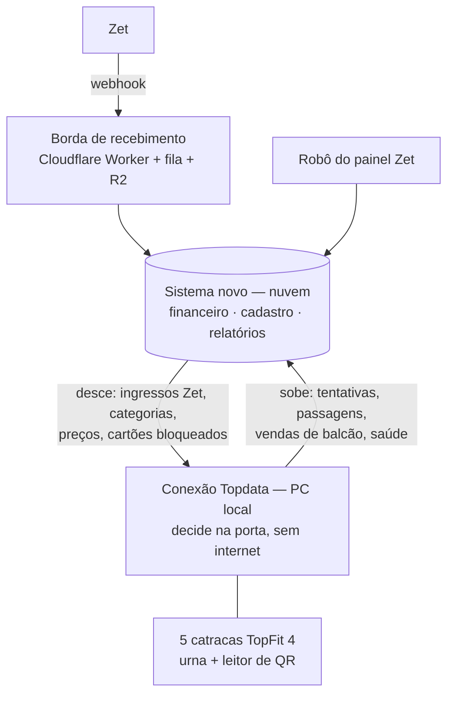

# Integração com o sistema das catracas (Conexão Topdata)

Fonte: repositório `rcarvalhocwb/conexao-topdata`, branch `claude/gallant-wright-pdloor` (commit `2d178c4`), lido em 26/09/2026, principalmente:
- `docs/15-integracao-e-sincronizacao.md`, `16-multiplos-provedores-de-ingresso.md`, `18-contrato-do-webhook.md`, `19-bilheteria-local-e-divisao-das-catracas.md` e `22-sistema-supabase.md`;
- ADR-0022 e ADR-0023;
- as migrações SQLite.

Nada foi alterado naquele repositório.

## 1. Os dois sistemas e quem é dono de quê



| Assunto | Dono | Por quê |
|---|---|---|
| Decidir se a pessoa passa | **Catracas (borda)** | Decide no PC local, sem depender de internet (ADR-0023 deles). A nuvem **nunca** fica no caminho do giro |
| O fato "passou / foi negado / girou" | **Catracas** | Quem viu é a borda; a nuvem registra e não revalida |
| Cadastro: ingressos Zet, categorias, preços, cartões bloqueados | **Sistema novo** | Vem do webhook e do robô da Zet, e da configuração do evento |
| Dinheiro: vendas, caixa, fechamento, conta Zet | **Sistema novo** | O livro-razão fica só aqui |
| Relatórios e assinaturas | **Sistema novo** | Usa os fatos que a borda sobe |

**O sistema novo substitui, do lado da nuvem, as funções antigas do Supabase** (`middleware-sync-cards`, `middleware-sync-events`, `middleware-heartbeat`) que a Conexão Topdata já mapeou. O desenho deles casa com o nosso:
- guardar o bruto antes de interpretar;
- outbox e idempotência;
- trilha imutável;
- "a nuvem fora do ar não barra ninguém".

## 2. O que já está alinhado

| Tema | Catracas | Sistema novo | Situação |
|---|---|---|---|
| Webhook da Zet sem assinatura; a URL é a credencial | ADR-0022 | `04-INTEGRACAO-ZET.md` | ✅ Mesmo diagnóstico |
| Guardar o payload bruto antes de interpretar | Relé "que não sabe o que é um ingresso" | Worker + R2 + inbox imutável | ✅ Mesma ideia |
| Falhas de segurança das funções antigas (sem segredo, `anon` lendo e gravando) | docs/22, 8.1 e 8.6 | `02-RELATORIO-DE-PROBLEMAS.md` (S-xx) | ✅ Os dois apontam o mesmo problema |
| Limite de 1.000 linhas do Supabase | docs/22, 8.2 | P-xx (limite de 1.000 linhas) | ✅ Os dois exigem paginação |
| Categoria fotografada em cada uso | `ticket_use_attempt.category` | Ticket médio e conferência por categoria | ✅ É exatamente o que o fechamento precisa |
| Autorizado ≠ girou | ADR-0007, `giro_confirmado` | Público = quem **girou** | ✅ |
| Corte do relatório imutável; atrasado vira delta | docs/16, seção 5 | Dia travado; ajuste no dia seguinte | ✅ Mesma regra |

## 3. O que precisa ser decidido (conflitos)

### 3.1 Quem recebe o webhook da Zet: **um só**
Os dois projetos planejam receber o webhook:
- **as catracas:** relé em `apizet.ruailuminada.com/webhook`, com o formato próprio do `docs/18`;
- **o sistema novo:** Worker `zet-ingest` com token na URL.

A Zet só aceita **um link por evento**.

**Recomendação:** o sistema novo recebe (Worker + fila + R2, já desenhado). As catracas **puxam** da nuvem os ingressos Zet já interpretados, por cursor (`IFonteDeIngressos` apontando para a nossa API), como o próprio docs/22 deles prevê.
- **Motivo:** o dinheiro, o estorno, a contestação e o robô vivem aqui. Duas cópias do webhook seriam duas verdades.
- **Formato:** o contrato do `docs/18` deles (`referencia`, `qr`, `situacao`, etc.) foi pensado como pedido à Zet, mas a Zet manda o formato dela (26 mil exemplos no backup). O sistema novo **traduz**:
  - `voucher` → `qr` e `referencia`;
  - `eventsValues` → categoria e validade da sessão;
  - pedido `ESTORNADO` ou `CONTESTADO` → `situacao = cancelado`.

  Assim a borda recebe exatamente o `docs/18` e não precisa conhecer a Zet.

### 3.2 "Retorno ao site" (dar baixa na Zet quando o QR passa na catraca)
O `docs/16` e o `docs/18` deles preveem enviar à Zet um aviso de consumo a cada QR validado na catraca. Isso **conflita com a regra R27** confirmada pelo dono do evento:
- a validação online é feita pela equipe da Zet, no app da Zet;
- o nosso lado **nunca altera nada na Zet**;
- a catraca só lê QR da Zet em dia de teste.

**Proposta:** a catraca **não** dá baixa na Zet. Quando validar um QR da Zet (dia de teste), ela sobe o fato para o sistema novo. O robô confere com a Lista de ingressos da Zet (voucher validado nos dois lados, só num, ou em nenhum).

**Risco que precisa de decisão:** se o mesmo voucher puder entrar pela fila da Zet (app) **e** pela catraca (QR), não há estado compartilhado em tempo real. A mesma pessoa, ou um print do QR, entra duas vezes. Opções:
- (a) a catraca não aceita QR da Zet nos dias normais (recomendado, é o que acontece hoje);
- (b) a Zet oferece uma API de consulta ou baixa (pergunta à Zet);
- (c) aceitar o risco e apontar a duplicidade no dia seguinte, pelo robô.

### 3.3 Venda de balcão: onde ela é registrada

> **Decisão para 2026 (26/09): opção C, como hoje.** Não há tempo antes do início das vendas (15/10). A venda no PC das catracas (opção A) fica para 2027. Em 2026, a conexão com a catraca (entrega 4 do roadmap) cobre: tentativas e passagens consumidas por categoria (conferência total bilheteria × catraca, público e ticket médio), saúde das catracas e cartões bloqueados.

A Conexão Topdata já tem `VenderNoBalcao`:
- uma linha em `ticket_sale` por venda, com cartão, categoria, usos, hora e operador;
- funciona sem internet;
- o cartão é um **recipiente**, revendido várias vezes no dia.

Ela ainda **não guarda guichê, preço nem meio de pagamento**, e não tem tela.

| Opção | Como funciona | Efeito no fechamento |
|---|---|---|
| **A. Venda no PC das catracas** (recomendada) | A tela de venda de balcão fica na borda (funciona sem internet) e grava também **guichê, preço e meio de pagamento**. A venda sobe para o sistema novo, que lança no caixa do guichê | O modo **"por guichê"** (R28) fica automático: cada guichê sabe quantos ingressos vendeu, de que tipo, e quanto deveria ter recebido |
| B. Venda no sistema novo | O guichê vende na nuvem e o cartão desce para a borda | **Para quando a internet cai**, com fila na bilheteria. Não recomendado |
| C. Como hoje | Cartão pré-carregado por tipo, sem registro de venda | Só o modo **"total da bilheteria"** (R28) |

### 3.4 A conta da catraca: **usos consumidos, não cartões**
Como o cartão é revendido (ciclo de uns 20 minutos), **um cartão pode ser três entradas pagas no mesmo dia**. A conferência bilheteria × catraca conta **cada uso consumido**, pela categoria fotografada na passagem. `fin.box_office_check` e o modelo do relatório foram corrigidos para isso. A repetição indevida já é barrada na borda pela urna, pelo intervalo de reuso e pela regra `VendaAnteriorNaoUsada`.

### 3.5 Número do cartão
O docs/22 (8.5) deles mostra cartões de 12 e de 14 dígitos, e o mesmo cartão cadastrado duas vezes. O número é **sempre texto**, e o perfil de normalização sai da bancada deles. O sistema novo guarda o número exatamente como a borda o normalizou e **não** tem regra própria de formato.

## 4. Contrato proposto entre os dois (versão 1)

A API fica no schema `api` do sistema novo (única superfície exposta), por RPC ou por uma edge function fina. Regras de acesso:
- **um segredo por PC de catraca**, rotacionável e guardado no cofre do Windows do lado deles;
- nunca a chave `service_role`;
- a borda **puxa**: a nuvem nunca abre conexão para o PC;
- toda resposta é paginada, com **cursor por sequência do servidor** (não por relógio).

| Sentido | Chamada | Conteúdo | Idempotência |
|---|---|---|---|
| Desce | `GET /catracas/v1/ingressos?cursor=` | Vouchers Zet no formato do `docs/18` deles: `referencia`, `qr`, `categoria`, `validoDe`/`validoAte` (sessão), `usos`, `situacao` (`valido`/`cancelado`) | Cursor; lote de até 500 |
| Desce | `GET /catracas/v1/configuracao` | Categorias e preços vigentes da bilheteria, guichês, intervalo de reuso, cartões bloqueados | Versão da configuração |
| Sobe | `POST /catracas/v1/tentativas` | Cada tentativa: `id` (gerado na borda), catraca, provedor, cartão ou QR, categoria fotografada, resultado (`consumido`/`negado` + motivo), `giro_confirmado`, `giro_em`, `ocorrido_em` (UTC com `Z`) | **Pelo `id` da borda** (a função antiga descartava o `event_id` e deduplicava por cartão + horário; aqui não) |
| Sobe | `POST /catracas/v1/vendas-balcao` (se a opção 3.3-A for adotada) | `id` da venda, cartão, categoria, usos, `vendido_em`, operador, **guichê, preço em centavos, meio de pagamento** | Pelo `id` da venda |
| Sobe | `POST /catracas/v1/saude` | Estado de cada catraca e do PC (urna cheia, sem comunicação, fila local) | Última leitura vence |
| — | Comandos remotos (abrir catraca pela nuvem) | **Não existem** na versão 1 (ADR-0023 deles) | — |

Respostas:
- `200` com a lista de `aceitos`, `repetidos` e `rejeitados` por `id` (nunca um "200" genérico que esconda falha parcial);
- `401` para segredo errado;
- `413` para lote grande demais.

```sql
-- espelho, na nuvem, das tentativas que a borda sobe (append-only, como o livro-razão)
create table access.ticket_use_attempts (
  id               uuid primary key,              -- gerado na borda: reenvio não duplica
  event_id         uuid not null references public.events(id) on delete restrict,
  device_id        text not null,
  provider         text not null check (provider in ('bilheteria','zet')),
  credential       text not null,                 -- número do cartão ou conteúdo do QR, como a borda normalizou
  ticket_ref       text,                          -- venda de balcão ou voucher Zet
  category         text,                          -- fotografada na passagem
  outcome          text not null check (outcome in ('consumido','negado')),
  reason           text,
  turnstile_turned boolean,                       -- giro confirmado pelo sensor
  turned_at        timestamptz,
  occurred_at      timestamptz not null,
  business_date    date not null,                 -- dia operacional (America/Sao_Paulo)
  received_at      timestamptz not null default now()
);
-- mesmos gatilhos de imutabilidade de fin.postings: nada de UPDATE/DELETE
```

## 5. O que o sistema novo faz com os fatos das catracas

| Fato que sobe | Uso |
|---|---|
| Usos consumidos da bilheteria, por categoria | Conferência **bilheteria × catraca** (R28, `fin.box_office_check`) e ticket médio da bilheteria |
| `turnstile_turned` | Público do dia = quem **girou**. "Liberado sem giro" aparece como linha de atenção |
| QR da Zet consumido (dia de teste) | Conferência com a Lista de ingressos da Zet (robô) |
| Tentativas negadas por motivo, e **QR desconhecido** | Seção de conciliações do relatório: QR desconhecido pode ser ingresso vendido que não chegou à borda, ou seja, cliente barrado por falha nossa |
| Vendas de balcão (opção 3.3-A) | Lançamento no caixa do guichê e modo "por guichê" |
| Saúde | Painel de operação; alerta de catraca parada ou de fila de envio crescendo |

## 6. Próximos passos

1. **Dono do evento decide** 3.1 (quem recebe o webhook), 3.2 (a catraca dá baixa na Zet ou não) e 3.3 (onde fica a venda de balcão).
2. Levar este documento à sessão do Conexão Topdata, para ela ajustar:
   - `IFonteDeIngressos` e `ConectorRest` para o contrato da seção 4;
   - a retirada do aviso de consumo à Zet, se 3.2 for "não";
   - guichê, preço e meio de pagamento em `ticket_sale`, se 3.3 for "A".
3. No sistema novo (roadmap, fase 2): publicar as chamadas da seção 4 com testes de contrato compartilhados. Um arquivo de exemplos de requisição e resposta fica nos dois repositórios, e os testes dos dois lados o usam.
4. Ensaio conjunto num **projeto de teste** (nunca na produção, que tem dados pessoais): a borda puxa ingressos, sobe tentativas, e o relatório do dia mostra a conferência bilheteria × catraca.
