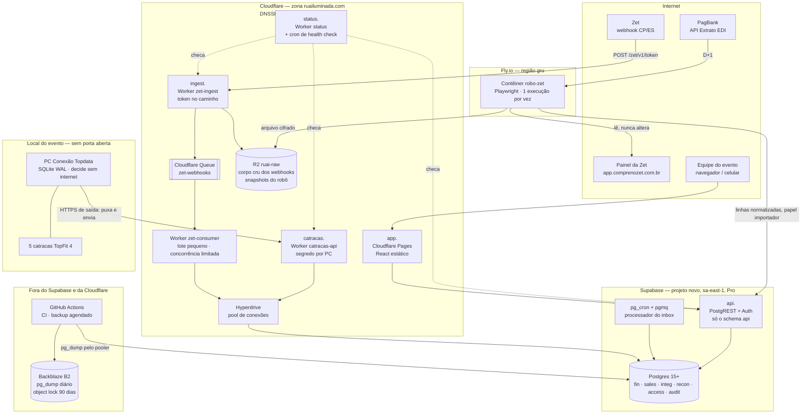

# 2. Arquitetura de produção

## 2.1 Diagrama

Fluxos que o diagrama garante:
- **A Zet nunca espera o banco.** `zet-ingest` confere o token, grava o corpo no R2, põe uma mensagem na fila e responde 200. O banco só aparece depois do consumidor.
- **O PC das catracas só abre conexões de saída.** A nuvem nunca chama o PC; nenhum comando remoto existe.
- **O navegador só fala com `api.`** e só enxerga o schema `api` (views de leitura e RPC com checagem de papel).
- **O robô só lê o painel da Zet.** Ele manda à nuvem linhas já normalizadas (em centavos, sem CPF, e-mail e telefone) e guarda o arquivo original cifrado no R2.

## 2.2 Mapa de subdomínios

| Subdomínio | Uso | Onde roda | Proxy Cloudflare |
|---|---|---|---|
| `app.ruailuminada.com` | Painel (React + Vite, estático) | Cloudflare Pages | Sim |
| `api.ruailuminada.com` | API do painel: PostgREST (`api.*`) e Auth | Supabase, domínio próprio (add-on "Custom Domain") | **A CONFIRMAR** se o domínio próprio do Supabase aceita o proxy da Cloudflare. Se não aceitar, fica só DNS, e a proteção é RLS + RPC + limites do Supabase. As superfícies críticas (ingest e catracas) têm WAF de qualquer forma |
| `ingest.ruailuminada.com` | Webhook da Zet: `POST /zet/v1/<token>` | Worker `zet-ingest` | Sim (Worker) |
| `catracas.ruailuminada.com` | API do middleware das catracas, contrato v1 | Worker `catracas-api` | Sim (Worker) |
| `status.ruailuminada.com` | Página de status pública (sem dados) | Worker `status` com cron trigger e KV | Sim (Worker) |
| `*-hml.ruailuminada.com` | Homologação: `app-hml`, `api-hml`, `ingest-hml`, `catracas-hml` | Mesmos componentes, ambiente `hml` | Sim |

Nomes que **saem de uso**:
- **`apizet.ruailuminada.com`**: previsto pelo relé do projeto das catracas (ADR-0022 deles). Não será usado (há um único receptor). Se existir registro DNS, remover.
- **`api.ruailuminada.com` no papel de webhook**: o endereço antigo vazou no código e na documentação. O Worker/rota antigos são removidos no congelamento do sistema antigo (`08-plano-de-virada.md`), e só depois `api.` passa a apontar para o sistema novo. Até lá, o painel usa o domínio `*.supabase.co` do projeto novo.

### TLS, HSTS, DNSSEC e CAA

| Item | Configuração | Verificação |
|---|---|---|
| Certificados | Universal SSL da Cloudflare nas bordas; modo **Full (strict)** para qualquer origem; TLS mínimo 1.2 | `curl -vI` em cada subdomínio; SSL Labs nota A |
| HSTS | `max-age=31536000; includeSubDomains`. `preload` **só depois** de conferir que nenhum subdomínio de `ruailuminada.com` (inclusive o site institucional) serve HTTP puro | Cabeçalho presente em todos os subdomínios |
| DNSSEC | Ligar na Cloudflare e publicar o registro DS no registrador do domínio (**quem tem acesso ao registrador: A CONFIRMAR**) | `dig +dnssec ruailuminada.com` com flag `ad` |
| CAA | Registros CAA só para as autoridades usadas pelo Universal SSL da Cloudflare (a Cloudflare lista e completa essas entradas quando há CAA na zona) e `iodef` para o e-mail de segurança | `dig CAA ruailuminada.com` |
| Token do webhook | Novo token: 32 bytes aleatórios em base64url (43 caracteres), só no cofre (segredo do Worker `ZET_URL_TOKEN`) e no cadastro do webhook no painel da Zet. **O token e o endereço antigos são revogados**: vazaram no código e na documentação | Requisição com o token antigo → 404 |

## 2.3 Cada componente: onde roda, como escala, como falha

| Componente | Onde roda | Como escala | Como falha | O que acontece quando falha |
|---|---|---|---|---|
| `zet-ingest` | Cloudflare Worker, rede global | Sozinho: cada requisição é independente e não toca o banco. Pico de reenvios (o que derrubou 2025) vira mensagens na fila | Cloudflare fora (raro, global); token errado; corpo > 64 KB | Cloudflare fora: a Zet recebe erro e reenvia pela política dela (**A CONFIRMAR** quantas vezes, Z-03). O robô recupera o que faltar pelo export (rede de segurança). Token errado: 404, nada gravado |
| Fila `zet-webhooks` | Cloudflare Queues | Absorve o pico; o consumidor puxa em lotes pequenos com concorrência limitada | Retenção padrão de 4 dias (configurável até 14): banco fora por mais que isso perderia mensagens da fila | **O corpo cru já está no R2** antes de a mensagem ir para a fila. Uma reconciliação R2 × inbox (job diário) reenfileira o que estiver no R2 e não no inbox. Retenção configurada no máximo |
| R2 `ruai-raw` | Cloudflare R2 | Armazenamento de objetos | Indisponível | `zet-ingest` responde 503 (a Zet reenvia). Nunca responde 200 sem ter gravado o corpo |
| `zet-consumer` | Cloudflare Worker (consumidor da fila) + Hyperdrive | Lote de até 10 mensagens, concorrência máx. 2 (valores iniciais, ajustáveis). Faz 1 INSERT idempotente por mensagem em `integ.webhook_inbox` | Banco fora ou lento | Mensagem volta para a fila com espera crescente. Depois das tentativas máximas, fila morta da Cloudflare + alerta. Nunca descarta |
| Processador do inbox | Dentro do Postgres: `pg_cron` a cada minuto drena `pgmq` e chama `integ.process_inbox(id)` (plpgsql, 1 pedido por transação, `pg_advisory_xact_lock` por pedido) | Serializado por pedido; volume de 2025 no maior dia: 943 pedidos (menos de 1 por minuto em média) | Erro de regra (evento sem de-para, voucher desconhecido) | Linha do inbox fica `failed` com o erro, alerta; reprocessa depois do ajuste. Nada é apagado |
| Painel (`app.`) | Cloudflare Pages + CDN | Estático; escala sozinho | Pages fora | O fechamento no sistema para. O plano B é papel: a folha de contagem do checklist `07`, parte A, lançada quando o sistema voltar. O dinheiro físico não depende do sistema estar no ar |
| API do painel (`api.`) | Supabase (PostgREST + Auth) em `sa-east-1` | Leituras por views agregadas no banco (nunca soma no navegador); escritas por RPC. Volume: dezenas de usuários | Supabase fora | Painel indisponível; webhooks continuam chegando (borda); catracas continuam decidindo e acumulando na fila local. Fechamento espera ou segue em papel |
| Postgres | Supabase, compute **Small** (ver `03`) | **Escritas não se balanceiam**: um primário, protegido por fila, pooler e limites de concorrência de cada cliente técnico | Queda de região ou do projeto | RPO ≤ 5 min (PITR); RTO 2 h (restauração). Borda da Zet e fila das catracas seguram tudo enquanto isso |
| Robô `robo-zet` | Fly.io, região `gru` (São Paulo), 1 máquina, 2 GB, liga sob demanda | **Uma execução por vez** (trava `integ.robot_runs_one_active` no banco) | Login falha, layout muda, Zet fora | Execução `falhou` + alerta; nada entra pela metade (validação de contagem e soma antes de importar). Fechamento **não trava**: relatório mostra "sem dados da Zet desde HH:MM" |
| `catracas-api` | Cloudflare Worker + Hyperdrive; papel de banco `catraca` | Lotes de até 500 itens; o PC drena por prioridade | Banco fora | 503; o PC mantém a fila local (outbox SQLite) e reenvia com espera crescente. **Nenhuma pessoa é barrada**: a decisão é local |
| PC das catracas | Local do evento, Windows | Um PC com as 5 catracas (ADR-0023 deles) | Internet fora | Normal para eles (`T1SemInternet`): decide igual; sobe depois |
| `status` | Worker + cron trigger (a cada minuto) + KV | — | — | A página lê do KV, não do banco: continua no ar com o banco fora |
| Backup | GitHub Actions agendado (diário, 04:00 BRT) → `pg_dump` pelo pooler em modo sessão → Backblaze B2 com *object lock* | — | Job falha | Alerta. PITR continua cobrindo |

### Por que não há Load Balancer da Cloudflare

Nenhum componente tem duas origens equivalentes para balancear: o banco é um primário único (escritas não se balanceiam), os Workers já rodam na rede global, e o robô é propositalmente único. **Não contratar Cloudflare Load Balancing.** Os health checks ficam no Worker `status`, que é mais barato e mede o que interessa (idade da mensagem mais antiga da fila, última execução do robô, último sinal de cada catraca).

### Réplica de leitura: não

Ver `03-decisao-de-banco.md`. O volume não justifica e a réplica complica a consistência dos relatórios assinados (que precisam ler exatamente o que foi lançado).

## 2.4 Credenciais técnicas (nenhuma é `service_role`)

| Quem | Credencial | Pode fazer |
|---|---|---|
| `zet-consumer` | Usuário de banco `ingest_writer` via Hyperdrive | Só `EXECUTE` em `integ.receive_webhook(...)` |
| `catracas-api` | Usuário de banco `catraca_gateway` via Hyperdrive; o Worker confere o segredo do PC (hash SHA-256 guardado em `access.edge_devices`, comparação em tempo constante) | Só `EXECUTE` nas funções `access.v1_*` |
| Robô | Usuário do Auth com papel `importador` (JWT curto, renovado a cada execução) | Só as RPC `api.import_*` e `api.robot_run_*` |
| Backup | Usuário de banco `backup_reader` (só leitura) | `pg_dump` |
| Migrações | Chave de acesso do Supabase CLI, só no CI de produção, com aprovação manual | Aplicar migrações |

`service_role` fica só no painel do Supabase, para emergência, com uso registrado no runbook.

## 2.5 Custo mensal estimado

Preços de tabela consultados em 26/09/2026 nas páginas oficiais; **A CONFIRMAR na contratação** (câmbio e impostos fora).

| Item | Temporada (out–jan) | Fora da temporada (fev–set) |
|---|---|---|
| Supabase Pro (organização) | US$ 25 | US$ 25 |
| Compute produção Small (US$ 15) menos crédito de US$ 10 | US$ 5 | US$ 5 |
| PITR 7 dias (exige compute Small ou maior) | US$ 100 | US$ 0 (desligado; backups diários do Pro + dump externo) |
| Projeto de homologação, Micro | US$ 10 | US$ 0 (pausado) |
| Domínio próprio no Supabase (add-on) | ~US$ 10 (**A CONFIRMAR**) | ~US$ 10 |
| Cloudflare Workers Paid (inclui 10 mi requisições, 1 mi operações de fila; R2 com cobrança por GB) | US$ 5 | US$ 5 |
| Cloudflare zona Pro (regras gerenciadas do WAF e mais regras de rate limit) | ~US$ 25 (**A CONFIRMAR**; plano Free tem WAF e rate limit limitados) | ~US$ 25 |
| Fly.io, 1 máquina 2 GB ligada sob demanda | ~US$ 5 a 12 | ~US$ 0 a 2 |
| Backblaze B2 (dumps de poucos GB) | < US$ 1 | < US$ 1 |
| GitHub (repositório privado, Actions) | US$ 0 a 4 | US$ 0 a 4 |
| **Total aproximado** | **~US$ 190 a 200** | **~US$ 70 a 75** |

O maior item é o PITR. É o seguro contra repetir 2025 e deve ficar ligado de 01/10 até o acerto final com a Zet.
