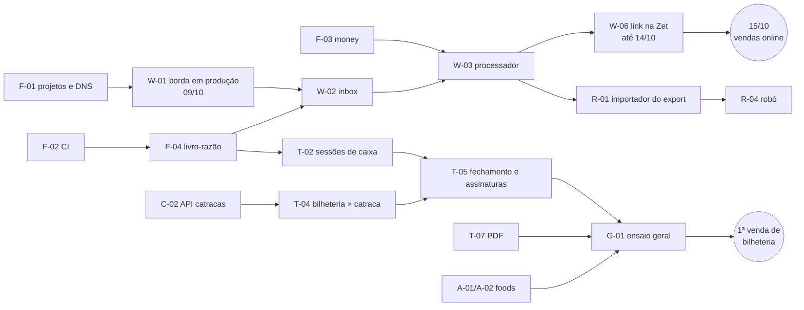

# 6. Caminho crítico e plano B

## 6.1 Caminho crítico

Dois caminhos críticos independentes:
1. **Online:** F-01/F-04 → W-01 → W-02 → W-03 → W-06 → 15/10. Folga: 1 dia útil (14/10). **É o que não pode atrasar.**
2. **Bilheteria:** F-04 → T-02 → T-05 → G-01 → 1ª venda de bilheteria. Folga depende da data de abertura (D-03).

A conexão com a catraca **não** está no caminho crítico do dinheiro: sem ela, o fechamento acontece; só a conferência bilheteria × catraca fica pendente (é informativa, R19).

O que se protege e o que se corta, se o time for menor ou algo atrasar:

| Prioridade | Protege (não sai de 2026) | Corta ou adia, nesta ordem |
|---|---|---|
| 1 | Borda durável (W-01) e inbox imutável (W-02) | 1º: relatórios complementares (A-07) → dezembro |
| 2 | Processador com estorno por voucher (W-03) | 2º: casamento do OFX (A-04) vira planilha de conferência conciliada à mão, com o extrato importado depois |
| 3 | Importação do export por upload (R-01, R-03) | 3º: robô automático (R-04, R-05) → upload manual diário do export (já coberto por R-01) |
| 4 | Sessões de caixa, fechamento, assinaturas e PDF (T-02, T-05, T-07) | 4º: EDI automático (T-03) → CSV do portal PagBank, mesmo importador |
| 5 | Foods com falta de repasse (A-01, A-02) | 5º: API das catracas (C-02) → importação de arquivo de tentativas (ver 6.5) |
| 6 | Conta-corrente Zet (A-03) | **Nunca cortar:** testes pgTAP, CI de segurança, PITR, dump externo |

Com **1 desenvolvedor**, os cortes 1 a 4 entram automaticamente (economia de 8,5 pd: 59,5 − 8,5 = 51 pd para 33 pd de capacidade) e ainda faltam 18 pd: nesse caso, a bilheteria só pode abrir no sistema novo depois de 30/11, e até lá o fechamento da bilheteria é feito em papel com as mesmas regras e lançado depois. O online (webhook e importação) continua protegido.

## 6.2 Se o webhook não estiver pronto em 13/10 (o dado bruto não pode se perder)

A peça que **não pode** faltar em 15/10 é a borda (W-01), não o processador. Ela é pequena (1,5 pd) e fica pronta em 09/10.

| Situação em 13/10 | O que fazer |
|---|---|
| Borda pronta, processador não | **Liga o link da Zet assim mesmo.** Tudo fica no R2 e no inbox (`pending`). Quando o processador ficar pronto, drena o inbox; a idempotência garante que nada duplica. Enquanto isso, o painel mostra "vendas online: X webhooks recebidos, processamento pendente" e o export da Zet baixado à mão serve de conferência |
| Borda pronta, consumidor (W-02) não | Mensagens ficam na fila (retenção configurada em 14 dias) **e** no R2. A reconciliação R2 × inbox recupera tudo depois, inclusive o que passar da retenção |
| Nem a borda está pronta | Plano C, só para não perder: Worker mínimo de 30 linhas que só confere o token e grava no R2 (sem fila). É o W-01 sem a fila, feito em horas. **Nunca** apontar a Zet para o sistema antigo nem para uma edge function que dependa do banco |
| Zet não cadastra o link a tempo | O export de Transações é completo (tem todos os pedidos pagos) e é importado por upload (R-01). Nada se perde; só se perde o tempo real |

Em todos os casos, o **export da Zet (R-01)** é a rede de segurança: fecha no centavo com a receita líquida do painel.

## 6.3 Se a Zet não liberar usuário só leitura

O vídeo do painel foi feito com a conta do dono do evento, que pode **Solicitar saque**. Um robô com essa senha poderia sacar dinheiro se tivesse um defeito ou fosse invadido.

| Situação | O que fazer |
|---|---|
| Usuário só leitura liberado | Robô agendado às 03:00 e botão "Sincronizar" ligados |
| Não liberado até 24/10 | **O robô não roda sozinho.** Ele fica disponível só no botão, com uma pessoa acompanhando a execução (a tela mostra cada etapa), e o agendamento da madrugada fica desligado. A lista de botões permitidos e o aborto diante de formulário continuam valendo |
| A Zet não quer robô de jeito nenhum | Upload manual diário dos 3 exports (R-01 a R-03) por um gestor. Custo: ~10 minutos por dia |

Pedir também à Zet: um usuário separado para o robô, com senha própria, para que a senha do dono nunca vá para o cofre do robô.

## 6.4 Se o PagBank não liberar o token do Extrato EDI a tempo

| Situação | O que fazer |
|---|---|
| Token liberado | Importação automática D+1 por terminal (T-03) |
| Não liberado até 07/11 | Gestor baixa todo dia o relatório de vendas do portal PagBank (CSV) e sobe no mesmo importador. O importador aceita as duas fontes e grava a origem (`pagbank_edi` ou `pagbank_csv`). **Formato do CSV: A CONFIRMAR** com um arquivo real antes de 31/10 |
| Nem CSV por terminal | Conferência só pelo total da maquininha declarado pelo operador (com foto do relatório) e pelo crédito no extrato bancário. A taxa real (MDR) é lançada quando a liquidação aparecer no banco. Perde-se a conferência por guichê em D+1, não o dinheiro |

## 6.5 Se a conexão com as catracas não estiver pronta

O lado do PC depende do ensaio de bancada `HIL-STACK-01` do projeto Conexão Topdata, que ainda não aconteceu, e da Fase 2 deles (motor de decisão), que depende desse ensaio.

| Situação | O que fazer |
|---|---|
| Nosso lado (C-02) pronto, PC não | Nada muda no dinheiro. A conferência bilheteria × catraca fica "pendente" no relatório |
| PC pronto, mas sem internet estável no evento | Normal (`T1SemInternet`): o PC acumula e sobe depois. A conferência sai quando os dados chegarem, como delta se o dia já estiver assinado |
| PC não fica pronto para a temporada | Endpoint de **importação de arquivo** no mesmo formato de `POST /catracas/v1/tentativas` (um JSON com a lista), subido pelo gestor. Se a catraca rodar com outro software, pedimos um export por categoria e dia (contagem de usos consumidos) e lançamos como "contagem declarada", marcada assim no relatório. **Não** religar as funções antigas `middleware-*` do sistema antigo, que estão abertas (docs/22, seção 8.1, do `conexao-topdata`) |

## 6.6 Outros pontos de falha com plano B

| Falha | Plano B |
|---|---|
| Supabase fora no dia do evento | Webhooks seguram na borda; catracas seguram no PC; guichês fecham em papel (checklist `07`, parte A) e lançam quando voltar, na data certa (dia ainda aberto) |
| Robô quebra por mudança de layout | Upload manual (R-01 a R-03) até corrigir |
| Assinante designado ausente | Admin troca a designação (vigência) antes da assinatura; fica no `audit.log` |
| Dia assinado com erro | Ajuste em dia aberto com `metadata.adjusts_business_date`; reabrir só se indispensável, por admin, com motivo |
